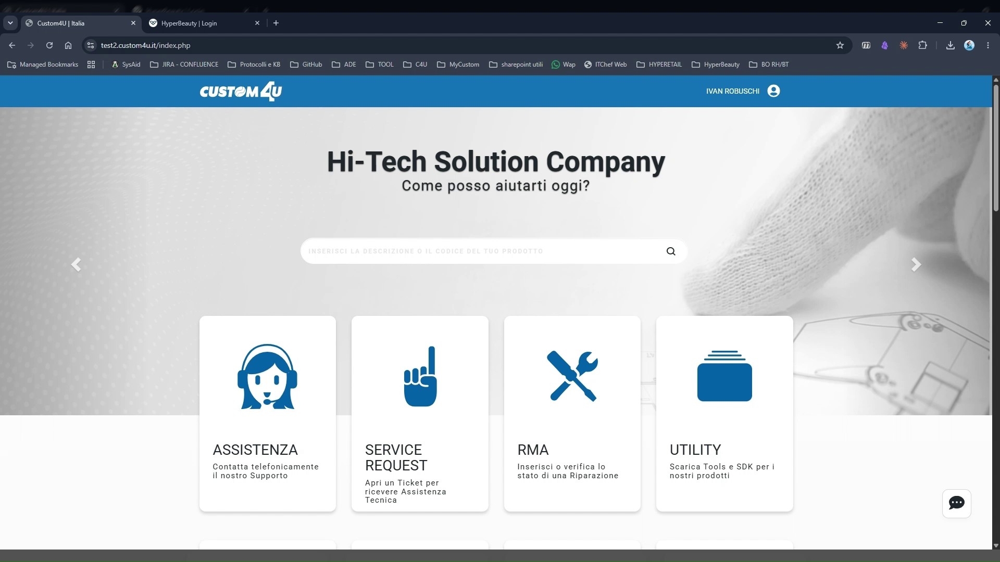
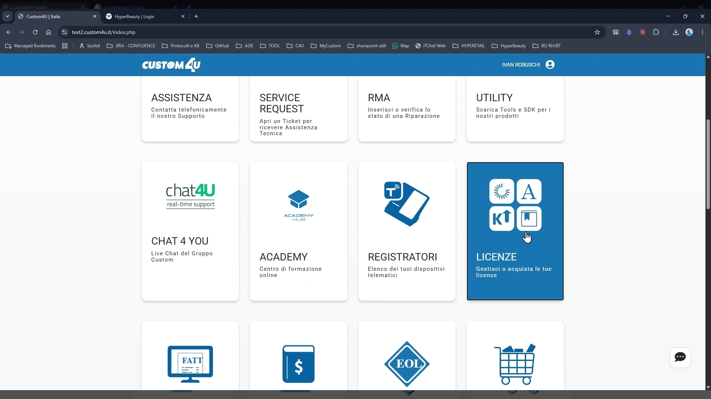
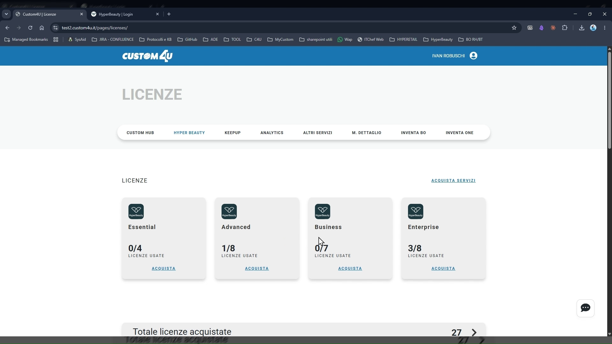
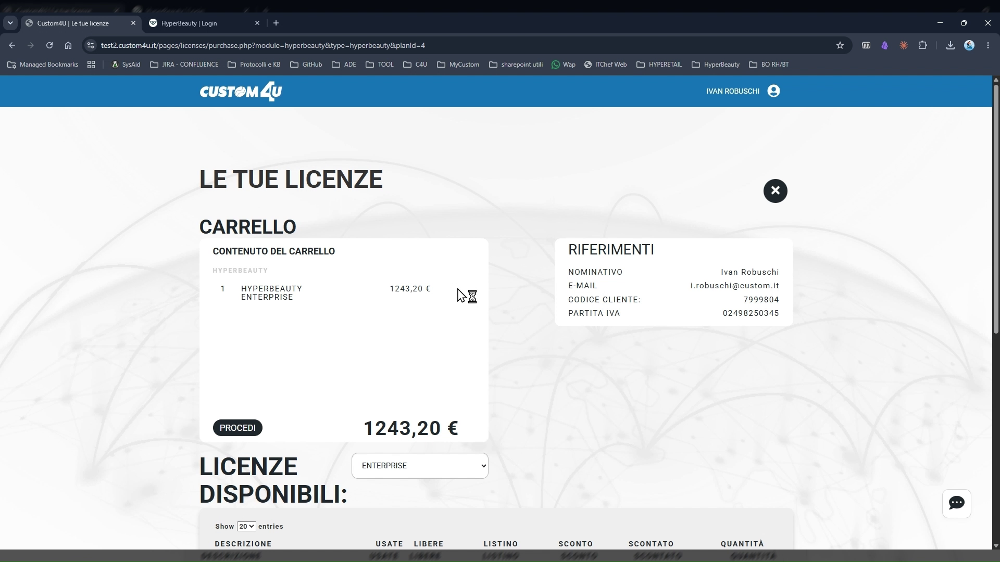
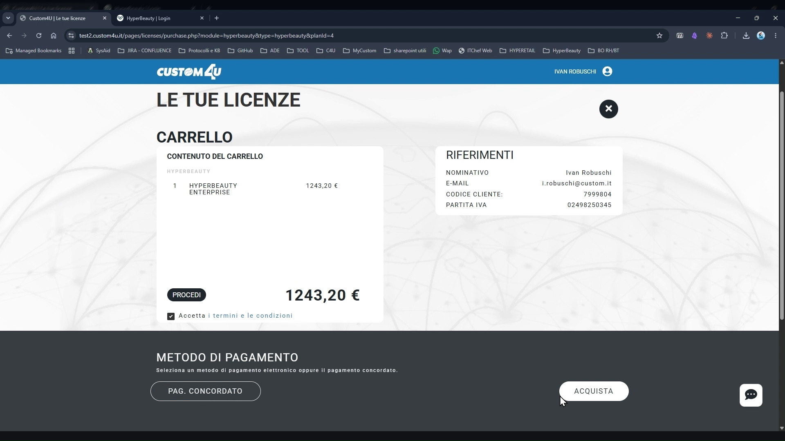
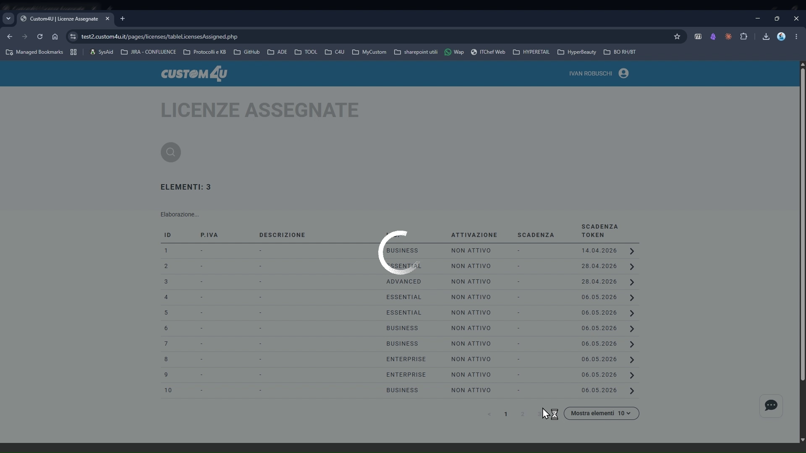
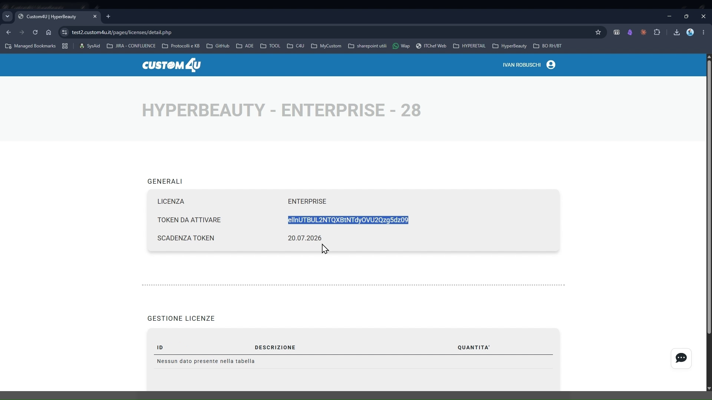
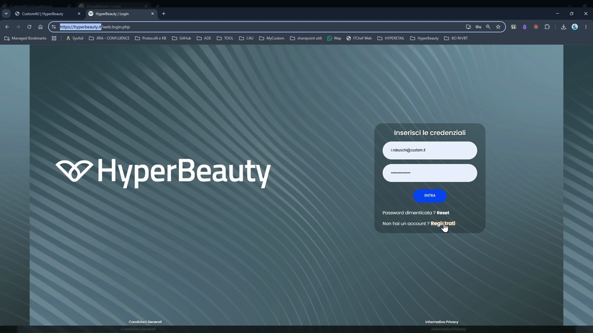
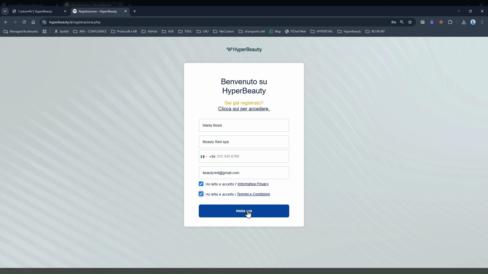

# Acquisto e Attivazione Licenza

Questa sezione guida il tecnico installatore attraverso le due fasi preliminari obbligatorie: l'acquisto della licenza HyperBeauty dal portale Custom4U e la sua attivazione all'interno dell'applicativo.

---

<video controls width="100%" style="border-radius:8px; margin-bottom:1.5rem;">
  <source src="assets/resources/acquisto_e_attivazione_licenza.mp4" type="video/mp4">
</video>

---

## Fase 1 — Acquisto della licenza su Custom4U

Le licenze HyperBeauty si acquistano esclusivamente dal portale **Custom4U** (`wwww.custom4u.it`), accessibile con le credenziali del rivenditore.

### Passo 1 — Accedere al portale Custom4U

Aprire il browser e navigare su `www..custom4u.it`. Effettuare il login con le proprie credenziali Custom4U.



Il portale mostra la dashboard principale con i servizi disponibili: Assistenza, Service Request, RMA, Utility e altri.

---

### Passo 2 — Navigare alla sezione Licenze

Dalla homepage del portale, individuare la voce **LICENZE** nel menu o scorrere verso il basso per raggiungere l'area dedicata ai prodotti software.



---

### Passo 3 — Selezionare il tab HYPERBEAUTY

Nella pagina Licenze, cliccare sul tab **HYPERBEAUTY**. Vengono visualizzati i quattro piani disponibili con il contatore di licenze già acquistate e quelle attualmente in uso.



| Piano | Descrizione |
|-------|-------------|
| **Essential** | Funzionalità di base — ideale per centri monoposto |
| **Advanced** | Funzionalità estese — per centri con più operatori |
| **Business** | Funzionalità avanzate + moduli aggiuntivi |
| **Enterprise** | Suite completa — per centri strutturati e catene |

!!! info "Quante licenze acquistare?"
    Il contatore mostra le licenze già acquistate (es. `1/8`) e quante sono già assegnate a installazioni attive. Acquistare solo il numero necessario di nuove licenze.

---

### Passo 4 — Aggiungere al carrello e completare l'acquisto

Cliccare su **ACQUISTA** sotto il piano desiderato. Si apre il carrello con il riepilogo dell'ordine e il totale da pagare. Verificare l'importo e completare l'acquisto.



!!! warning "Attenzione — fatturazione"
    L'acquisto genera una fattura intestata all'account rivenditore. Verificare i dati di fatturazione prima di confermare.

---

### Passo 5 — Verifica dell'acquisto

Dopo la conferma dell'ordine, tornare alla pagina **Licenze → HYPERBEAUTY**. Il contatore del piano acquistato si incrementa di 1, confermando che la licenza è disponibile nel portafoglio.



---

## Fase 2 — Recupero del Token di attivazione

Ogni licenza acquistata e non ancora attivata ha uno stato **NON ATTIVO** e un **token temporaneo** da usare per la registrazione su HyperBeauty.

### Passo 6 — Aprire le Licenze Assegnate

Nella pagina Licenze, cliccare sulla freccia accanto a **Totale licenze acquistate** in fondo alla pagina. Si apre la tabella **LICENZE ASSEGNATE** con l'elenco completo.



La tabella mostra per ogni licenza:

- **ID** — identificativo univoco
- **LIC.** — piano (Essential / Advanced / Business / Enterprise)
- **ATTIVAZIONE** — data di attivazione (o "NON ATTIVO")
- **SCADENZA** — data di scadenza della licenza attiva
- **SCADENZA TOKEN** — data entro cui il token deve essere usato per attivare

!!! warning "Scadenza del token"
    Il token di attivazione ha una **scadenza** (colonna SCADENZA TOKEN). Se non viene utilizzato entro tale data, la licenza rimane bloccata e sarà necessario contattare il supporto Custom. Procedere all'attivazione il prima possibile dopo l'acquisto.

---

### Passo 7 — Copiare il Token di attivazione

Cliccare sulla freccia `>` in corrispondenza della licenza con stato **NON ATTIVO** appena acquistata. Si apre la pagina di dettaglio con il campo **TOKEN DA ATTIVARE**.



Selezionare il token e copiarlo negli appunti (`Ctrl+C` / `Cmd+C`). Il token è una stringa alfanumerica univoca, ad esempio:
```
cIInUTBUL2NTQXBtNTdyOVU2Qzg5dz09
```

---

## Fase 3 — Attivazione su HyperBeauty

### Passo 8 — Aprire HyperBeauty e avviare la registrazione

Aprire una nuova scheda del browser e navigare all'indirizzo HyperBeauty fornito da Custom S.p.a. Si apre la schermata di login.



Poiché si tratta di una nuova installazione, il centro non è ancora registrato. La registrazione avviene tramite il token.

---

### Passo 9 — Compilare il modulo di registrazione

Nella schermata di benvenuto, compilare tutti i campi richiesti:



1. **Nome e Cognome** — referente principale del centro
2. **Nome del centro / Ragione sociale** — come verrà identificato in HyperBeauty
3. **Numero di telefono** — con prefisso internazionale
4. **Indirizzo email** — sarà l'email di accesso all'account

Spuntare le caselle di **Informativa Privacy** e **Termini e Condizioni**, quindi cliccare su **INIZIA LA**.

!!! info "Dove inserire il Token?"
    Dopo aver cliccato **INIZIA LA**, il sistema richiederà il token di attivazione ricevuto al Passo 7. Incollarlo nel campo dedicato (`Ctrl+V` / `Cmd+V`) e confermare.

---

## Riepilogo del flusso

| # | Azione | Dove |
|---|--------|------|
| 1 | Login al portale | `www.custom4u.it` |
| 2 | Navigare a Licenze → HYPERBEAUTY | Portale Custom4U |
| 3 | Selezionare il piano e cliccare ACQUISTA | Portale Custom4U |
| 4 | Completare il carrello | Portale Custom4U |
| 5 | Aprire Licenze Assegnate | Portale Custom4U |
| 6 | Copiare il TOKEN DA ATTIVARE della nuova licenza | Portale Custom4U |
| 7 | Aprire HyperBeauty e compilare la registrazione | App HyperBeauty |
| 8 | Incollare il token e confermare l'attivazione | App HyperBeauty |

!!! success "Attivazione completata"
    Al termine della registrazione, HyperBeauty crea il profilo del centro e reindirizza direttamente all'interfaccia principale. La licenza nella tabella del portale Custom4U passerà dallo stato **NON ATTIVO** ad **ATTIVO** con la data di attivazione e di scadenza aggiornate.

---

*Documento a cura di Custom S.p.a. — HyperBeauty Training Program — Versione 1.0 — Giugno 2026*
