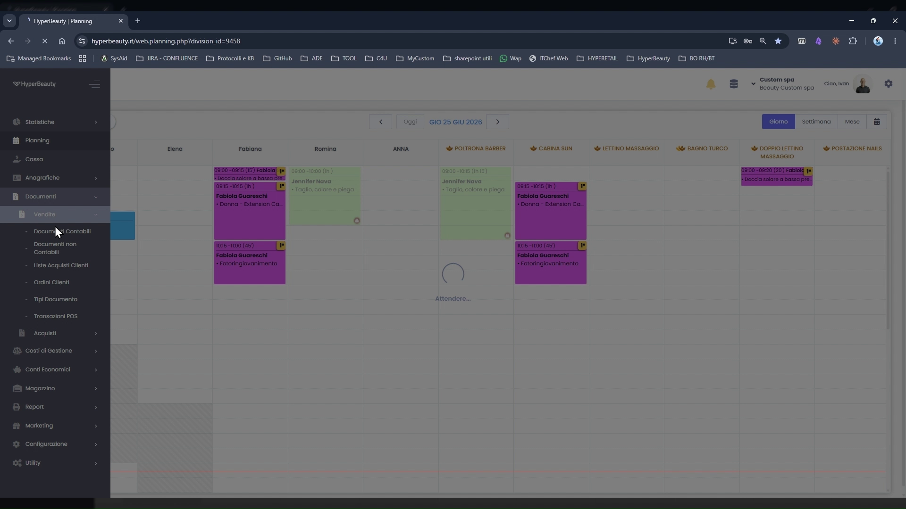
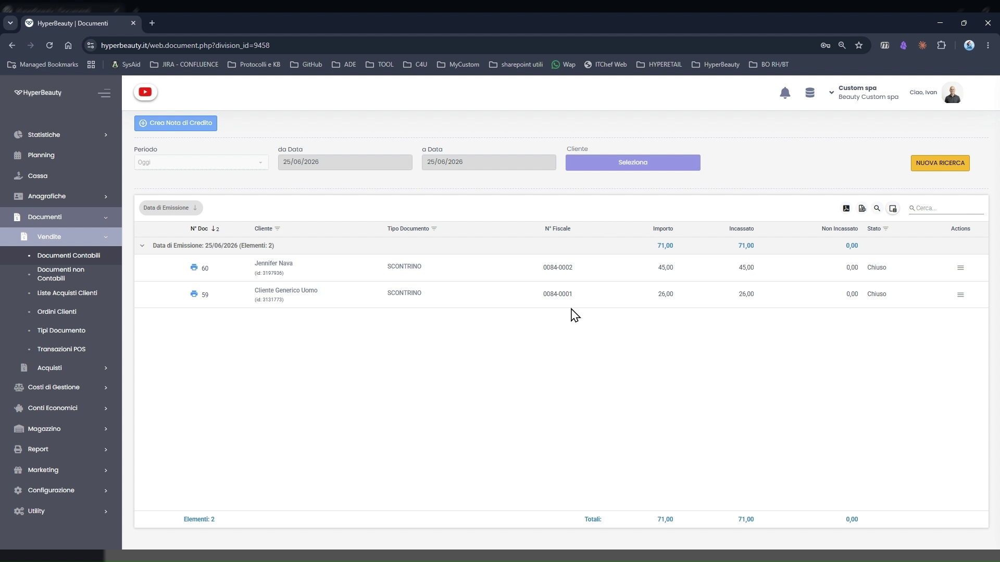
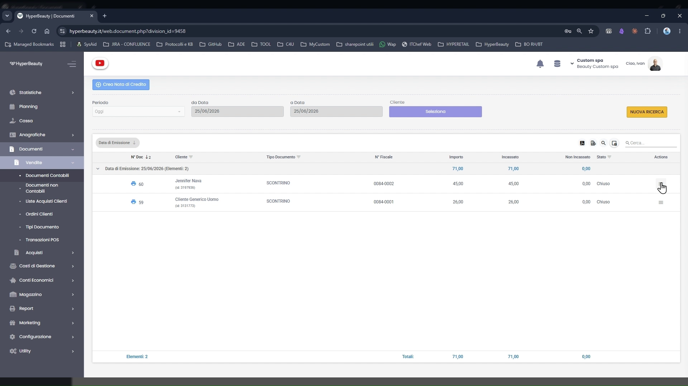
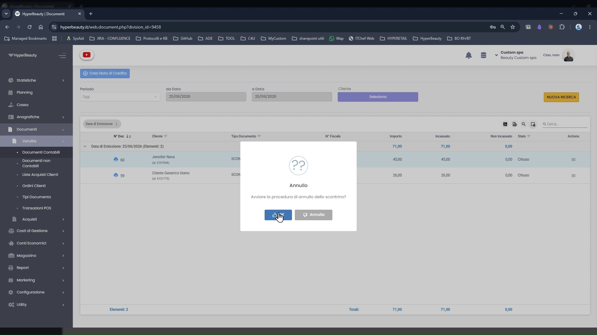
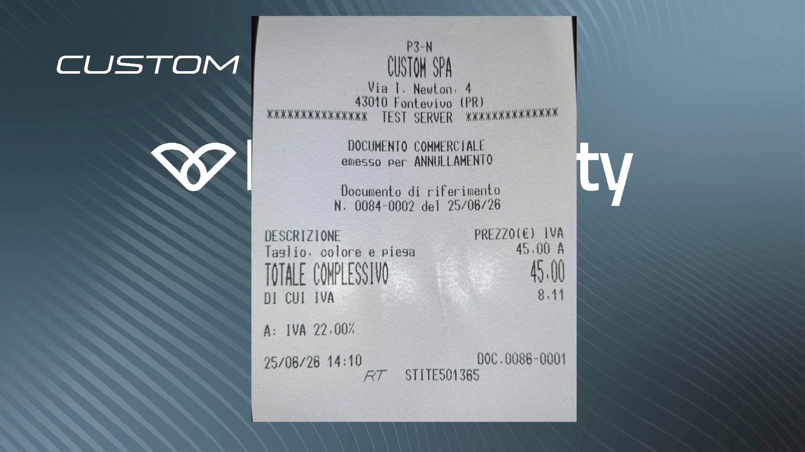

# Annullo Documento Commerciale

L'annullo di uno scontrino fiscale si esegue dalla sezione **Documenti → Vendite**. Il gestionale invia il comando al Registratore Telematico che stampa un **Documento Commerciale emesso per: ANNULLAMENTO** con riferimento al numero dello scontrino originale, come previsto dalla normativa fiscale vigente.

!!! warning "Annullo vs. Reso"
    L'annullo è applicabile agli scontrini emessi nella stessa giornata fiscale (prima della Chiusura Z). Per documenti di giorni precedenti occorre emettere una **Nota di Credito** tramite il pulsante apposito nella stessa schermata.

---

<video controls width="100%" style="border-radius:8px; margin-bottom:1.5rem;">
  <source src="../assets/resources/annullo_doc_comm.mp4" type="video/mp4">
</video>

---

## Accedere a Documenti → Vendite



**Percorso:** Menu laterale sinistro → **Documenti** → **Vendite**

La sezione Documenti contiene tutte le tipologie di registrazioni contabili. Vendite è la voce che elenca gli scontrini e i documenti commerciali emessi.

---

## Trovare lo scontrino da annullare



La schermata mostra i documenti filtrati per il periodo corrente (default: oggi). Per ogni riga sono visibili:

| Colonna | Descrizione |
|---------|-------------|
| **N°** | Numero progressivo interno |
| **Cliente** | Intestatario dello scontrino |
| **Tipo Documento** | Es. SCONTRINO |
| **N° Fiscale** | Numero fiscale dell'RT (es. 0084-0002) |
| **Importo** | Totale documento |
| **Incassato** | Quanto è già stato incassato |
| **Stato** | **Chiuso** = scontrino emesso e incassato |

Usare i filtri **da Data / a Data** e **Cliente** per restringere la ricerca, poi cliccare **NUOVA RICERCA**.

---

## Avviare la procedura di annullo



Individuato lo scontrino da annullare, cliccare l'icona **⋮** (tre punti) nella colonna **Azioni** a destra della riga. Dal menu contestuale selezionare l'opzione di annullo.

---

## Confermare l'annullo



Il sistema mostra la finestra di conferma:

> **Annullo**
> *Avviare la procedura di annullo dello scontrino?*

Cliccare ✓ per confermare. L'operazione è irreversibile: il gestionale invia il comando all'RT e la procedura di annullo viene eseguita immediatamente.

---

## Il documento di annullamento stampato dall'RT



Il Registratore Telematico stampa un nuovo documento fiscale con la dicitura:

```
DOCUMENTO COMMERCIALE
emesso per: ANNULLAMENTO

Documento di riferimento
N: 0084-0002 del 25/06/26

Taglio, colore e piesa   45,00 A
TOTALE COMPLESSIVO       45,00
```

Il documento riporta sempre il **numero di riferimento** dello scontrino originale annullato e viene trasmesso automaticamente all'Agenzia delle Entrate come rettifica.

!!! tip "Nota di Credito per giorni precedenti"
    Se lo scontrino da annullare è stato emesso in una giornata fiscale già chiusa (Chiusura Z già eseguita), usare il pulsante **Crea Nota di Credito** in alto nella schermata Documenti → Vendite. La nota di credito ha lo stesso effetto fiscale dell'annullo ma è applicabile anche a documenti di giorni precedenti.

---

## Riepilogo

| Passo | Azione |
|-------|--------|
| 1 | Menu laterale → **Documenti** → **Vendite** |
| 2 | Impostare i filtri di data/cliente e cliccare **NUOVA RICERCA** |
| 3 | Individuare lo scontrino da annullare (Stato: Chiuso) |
| 4 | Cliccare **⋮** → selezionare annullo |
| 5 | Confermare con ✓ nel dialog |
| 6 | L'RT stampa il documento di annullamento |

---

*Documento a cura di Custom S.p.a. — HyperBeauty Training Program — Versione 1.0 — Giugno 2026*
