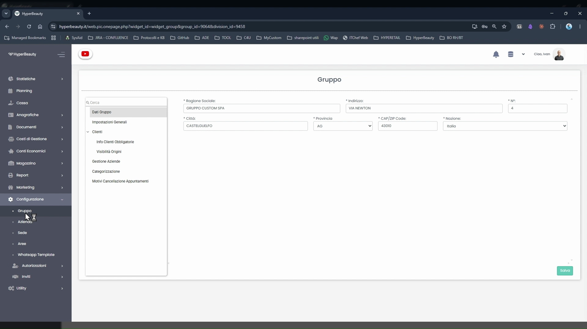
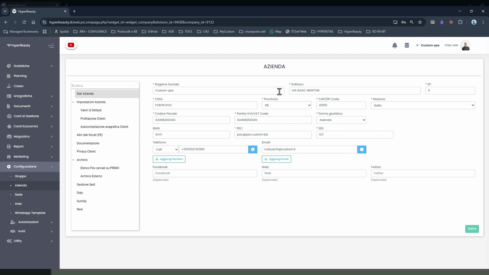
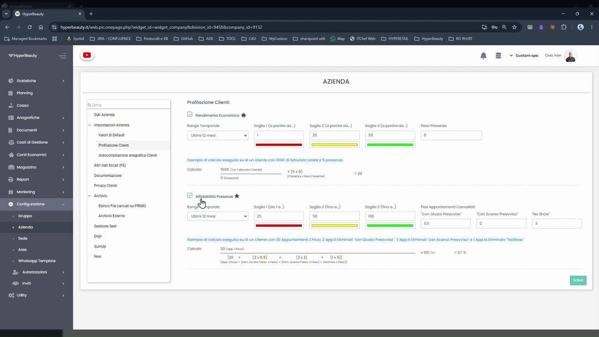
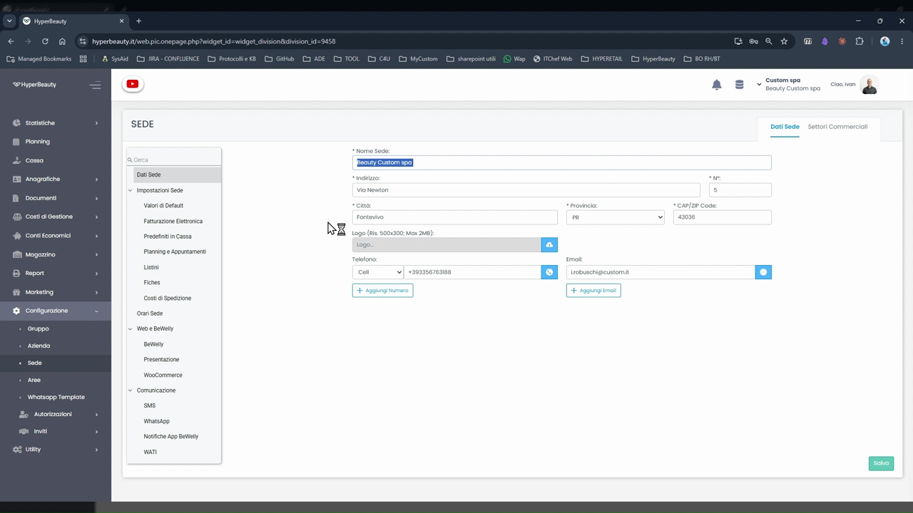
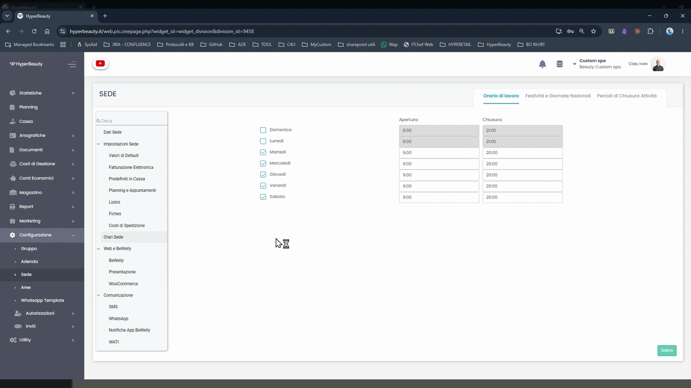
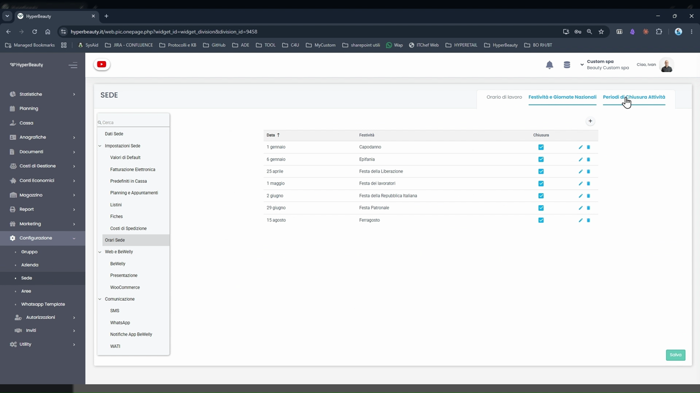
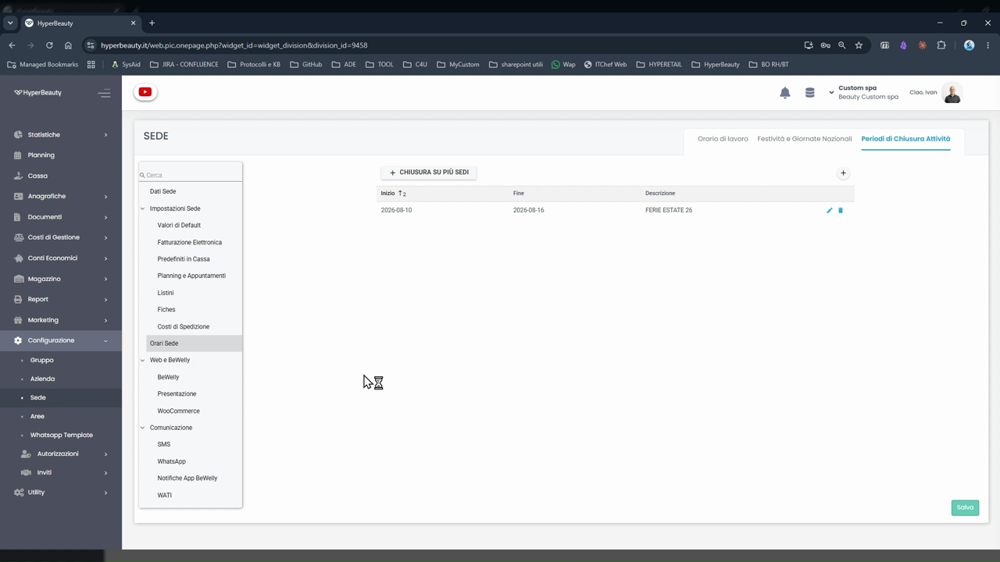

# Configurazione Azienda e Sede

Prima di creare operatori e inserire il listino, è obbligatorio configurare i dati fiscali dell'azienda e gli orari operativi della sede. HyperBeauty utilizza questi dati per i documenti fiscali, la griglia dell'agenda e le comunicazioni ai clienti.

---

<video controls width="100%" style="border-radius:8px; margin-bottom:1.5rem;">
  <source src="../assets/resources/azienda_sedi.mp4" type="video/mp4">
</video>

---

## La gerarchia: Gruppo → Azienda → Sede

**Percorso:** Menu laterale → **Configurazione**

HyperBeauty organizza i dati su tre livelli gerarchici:

| Livello | Quando si usa |
|---------|---------------|
| **Gruppo** | Solo per catene franchising con più aziende sotto un'unica holding. Nel **99% dei casi non si usa**. |
| **Azienda** | L'entità fiscale: ragione sociale, P.IVA, codice fiscale. Una sola per ogni attività. |
| **Sede** | L'unità operativa. Una stessa azienda può avere più sedi (es. tre saloni con la stessa P.IVA → 1 azienda, 3 sedi). |

!!! info "Multi-sede"
    Una stessa azienda con più punti vendita si configura come **1 Azienda + N Sedi**. Ogni sede ha i propri orari, operatori e listini indipendenti. Gestire ogni sede in una scheda browser separata.

---

## Configurazione Azienda

**Percorso:** Configurazione → **Azienda** → **Dati Azienda**

### Dati obbligatori

| Campo | Note |
|-------|------|
| **Ragione Sociale** | Nome dell'attività come appare sui documenti fiscali |
| **Partita IVA / VAT Code** | Obbligatoria — usata per scontrini e fatture |
| **Codice Fiscale** | Se diverso dalla P.IVA |
| **Forma giuridica** | Es. Azienda, Ditta individuale, SRL |
| **Indirizzo** | Via, numero civico, città, provincia, CAP |
| **Nazione** | Determina automaticamente aliquote IVA, valuta in cassa e obbligatorietà dei campi fiscali |

!!! warning "Campo Nazione"
    Il campo **Nazione** è critico: imposta in automatico le aliquote IVA, la valuta visualizzata in cassa (es. CHF per Svizzera) e l'obbligatorietà di P.IVA e CF. Nazioni supportate: **Italia, Svizzera, Spagna, Irlanda, San Marino**. Impostarlo correttamente prima di qualsiasi altra configurazione.

!!! tip "Ditta individuale"
    Selezionando **Ditta individuale** come forma giuridica compaiono i campi aggiuntivi per nome e cognome del titolare, che vengono riportati sui documenti fiscali.

### Dati facoltativi

Nella stessa sezione è possibile inserire: sito web, telefono, email aziendale, profili social. Questi dati vengono utilizzati nelle comunicazioni automatiche verso i clienti.

---

## Profilazione Clienti

**Percorso:** Configurazione → **Azienda** → **Profilazione Clienti**

Questa sezione definisce le **soglie** che determinano il colore dell'icona salvadanaio 🐷 visibile su ogni cliente in agenda e in cassa:

- **Rendimento Economico** — soglie di fatturato per classificare i clienti in fascia rossa / gialla / verde
- **Abbandono Presence** — soglie temporali oltre cui un cliente viene considerato "dormiente"

!!! info "Valori predefiniti"
    I valori di default sono già impostati e funzionanti. È possibile lasciarli invariati nella fase di startup e personalizzarli in un secondo momento quando si conosce meglio il parco clienti del salone.

---

## Configurazione Sede

**Percorso:** Configurazione → **Sede** → **Dati Sede**

### Dati da compilare

| Campo | Descrizione |
|-------|-------------|
| **Nome Sede** | Nome del punto vendita (può essere diverso dalla ragione sociale) |
| **Indirizzo** | Via, numero civico, città, provincia, CAP |
| **Logo** | Immagine del salone (max 500×300 px, max 2 MB) — compare su BeWelly e prenotazione online |
| **Telefono** | Numero principale; cliccando **+ Aggiungi Numero** si possono aggiungere numeri aggiuntivi |
| **Email** | Email operativa della sede; cliccabile **+ Aggiungi Email** per più indirizzi |

La scheda **Sede** nel menu laterale espone anche tutte le impostazioni avanzate della sede:

- **Impostazioni Sede** — Valori di Default, Fatturazione Elettronica, Predefiniti in Cassa, Planning e Appuntamenti, Listini, Fiches, Costi di Spedizione
- **Orari Sede** — orari di lavoro, festività, periodi di chiusura
- **Web e BeWelly** — BeWelly, Presentazione, WooCommerce
- **Comunicazione** — SMS, WhatsApp, Notifiche App BeWelly, WATI

---

## Orari di Lavoro

**Percorso:** Configurazione → **Sede** → **Orari Sede** → tab **Orario di lavoro**

Per ogni giorno della settimana: spuntare la casella per abilitarlo, poi inserire l'orario di **Apertura** e **Chiusura**.

!!! warning "Orari e agenda"
    Questi orari definiscono la **griglia temporale dell'agenda**: HyperBeauty mostrerà solo le fasce orarie in cui la sede è aperta. Un orario errato qui si ripercuote direttamente sulla disponibilità visualizzata nel planning.

**Esempio tipico:**

| Giorno | Apertura | Chiusura |
|--------|----------|----------|
| Domenica | — | Chiuso |
| Lunedì | 08:00 | 21:00 |
| Martedì–Venerdì | 09:00 | 20:00 |
| Sabato | 09:00 | 20:00 |

Cliccare **Salva** dopo ogni modifica.

---

## Festività e Giornate Nazionali

**Percorso:** Configurazione → **Sede** → **Orari Sede** → tab **Festività e Giornate Nazionali**

HyperBeauty carica automaticamente le festività nazionali del paese impostato nell'Azienda. Per ogni festività è possibile indicare se il salone rimarrà **chiuso** (spuntare la casella Chiusura) o se resterà aperto con orario normale.

Festività precaricate per l'Italia:

- 1 gennaio — Capodanno
- 6 gennaio — Epifania
- 25 aprile — Festa della Liberazione
- 1 maggio — Festa dei lavoratori
- 2 giugno — Festa della Repubblica Italiana
- 29 giugno — Festa Patronale *(modificabile per comune)*
- 15 agosto — Ferragosto
- e altre festività nazionali

---

## Periodi di Chiusura Attività

**Percorso:** Configurazione → **Sede** → **Orari Sede** → tab **Periodi di Chiusura Attività**

Permette di inserire **periodi di chiusura personalizzati** (ferie estive, ristrutturazione, chiusura straordinaria). Per ogni periodo inserire:

- **Inizio** — data di inizio chiusura
- **Fine** — data di fine chiusura
- **Descrizione** — etichetta identificativa (es. "FERIE ESTATE 26")

Il pulsante **+ Chiusura su più Sedi** consente di applicare lo stesso periodo di chiusura a tutte le sedi dell'azienda in un'unica operazione — molto utile per catene con più punti vendita.

!!! tip "Effetto sul planning"
    Durante un periodo di chiusura inserito qui, l'agenda blocca automaticamente la possibilità di creare nuovi appuntamenti nelle date indicate. I clienti che tentano di prenotare online tramite BeWelly vedranno quelle date come non disponibili.

---

## Riepilogo configurazione

| Sezione | Percorso | Obbligatorio |
|---------|----------|:---:|
| Dati Azienda | Configurazione → Azienda → Dati Azienda | ✅ |
| Orari Sede | Configurazione → Sede → Orari Sede → Orario di lavoro | ✅ |
| Dati Sede | Configurazione → Sede → Dati Sede | ✅ |
| Festività | Configurazione → Sede → Orari Sede → Festività | Consigliato |
| Periodi chiusura | Configurazione → Sede → Orari Sede → Periodi chiusura | Facoltativo |
| Profilazione Clienti | Configurazione → Azienda → Profilazione Clienti | Facoltativo |

---

*Documento a cura di Custom S.p.a. — HyperBeauty Training Program — Versione 1.0 — Giugno 2026*
