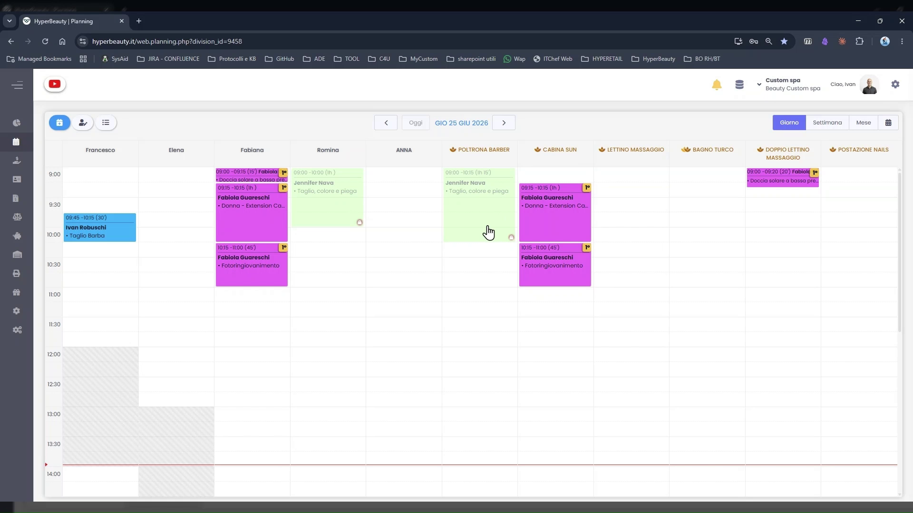
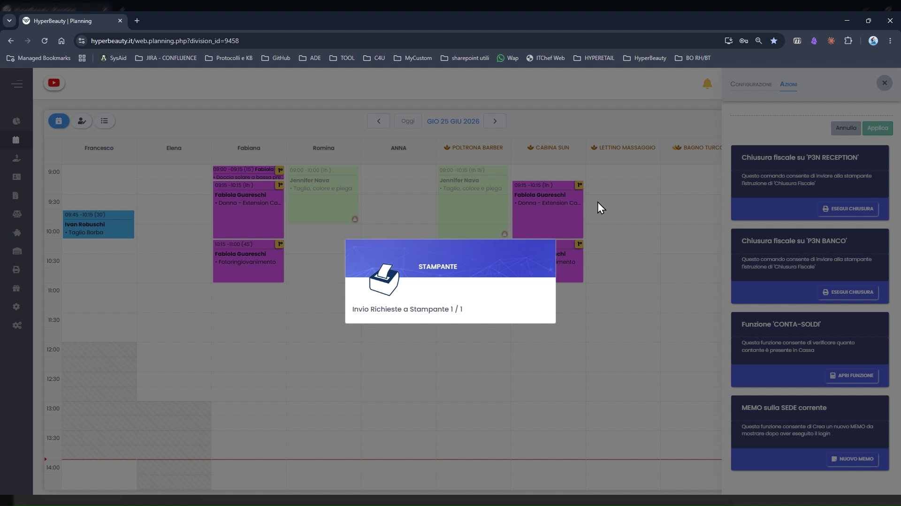
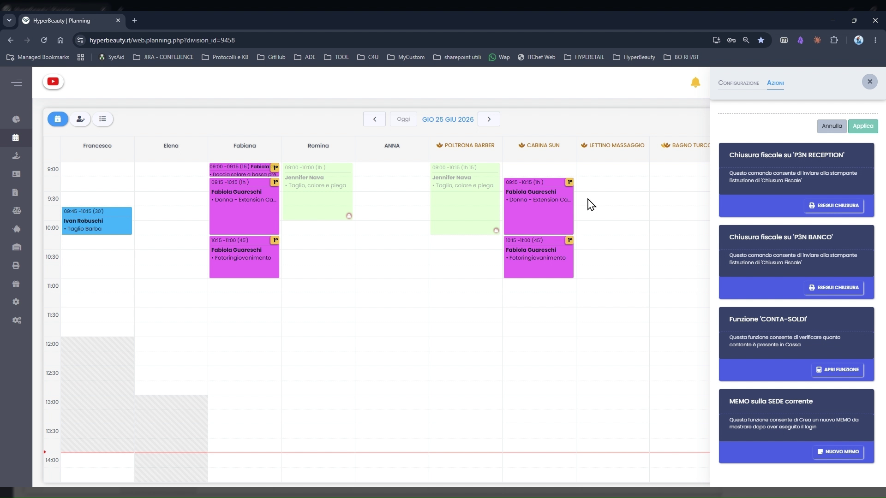

# Chiusura Giornaliera

La chiusura fiscale giornaliera — detta **Chiusura Z** — azzera i totali del Registratore Telematico e trasmette i corrispettivi all'Agenzia delle Entrate. Va eseguita **ogni sera a fine turno**, dopo l'ultimo incasso della giornata. In HyperBeauty si avvia direttamente dal Planning senza uscire dal gestionale.

!!! warning "Obbligo fiscale"
    La Chiusura Z è un adempimento fiscale obbligatorio. Deve essere eseguita ogni giorno lavorativo in cui sono stati emessi scontrini. Non eseguirla equivale a mancata trasmissione telematica dei corrispettivi.

---

<video controls width="100%" style="border-radius:8px; margin-bottom:1.5rem;">
  <source src="../assets/resources/chiusura.mp4" type="video/mp4">
</video>

---

## Aprire il pannello Azioni dal Planning

**Percorso:** Planning → icona **⚙️ ingranaggio** in alto a destra → tab **Azioni**

Il pannello laterale si apre sulla destra con il tab Azioni selezionato.

---

## Il pannello Azioni

Il pannello mostra una scheda per ogni azione disponibile:

| Scheda | Funzione |
|--------|----------|
| **Chiusura Fiscale su [nome stampante]** | Invia il comando di Chiusura Z al Registratore Telematico indicato. Appare una scheda per ogni RT configurato nel salone (es. RECEPTION, BANCO). |
| **Funzione CONTA-SOLDI** | Strumento per contare e registrare il contante presente in cassa a fine turno. |
| **MEMO sullo SIZE corrente** | Permette di visualizzare o inserire note/memo relativi al turno corrente. |

---

## Eseguire la Chiusura Fiscale

Cliccare il pulsante **STAMPA** sulla scheda **Chiusura Fiscale su [nome stampante]** corrispondente all'RT da chiudere.

Il sistema mostra brevemente una finestra **STAMPANTE** con il messaggio *"Invio Richiesta di Stampa/operazione..."* — la comunicazione con l'RT è in corso.

Quando il modal si chiude automaticamente, la Chiusura Z è stata inviata con successo. Il Registratore Telematico stampa il documento di chiusura fiscale e trasmette i dati all'Agenzia delle Entrate.

!!! tip "Salone con più RT"
    Se il salone ha più Registratori Telematici (es. uno alla reception e uno al banco), nel pannello Azioni appare una scheda **Chiusura Fiscale** per ognuno. Eseguire la chiusura su ciascun RT separatamente.

---

## Riepilogo

| Passo | Azione |
|-------|--------|
| 1 | Terminare tutti gli incassi della giornata |
| 2 | Planning → ⚙️ ingranaggio → tab **Azioni** |
| 3 | Cliccare **STAMPA** sulla scheda Chiusura Fiscale |
| 4 | Attendere il completamento (modal si chiude automaticamente) |
| 5 | Verificare la stampa del documento di chiusura dall'RT |

---

*Documento a cura di Custom S.p.a. — HyperBeauty Training Program — Versione 1.0 — Giugno 2026*
