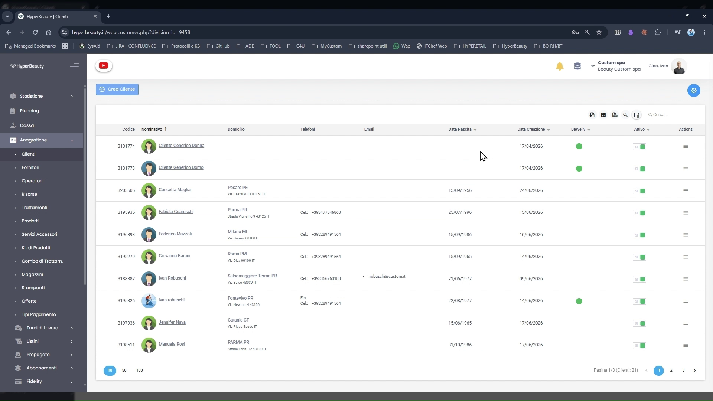
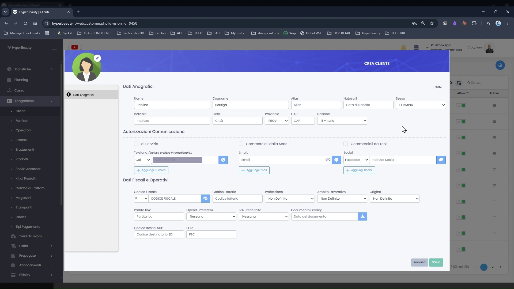
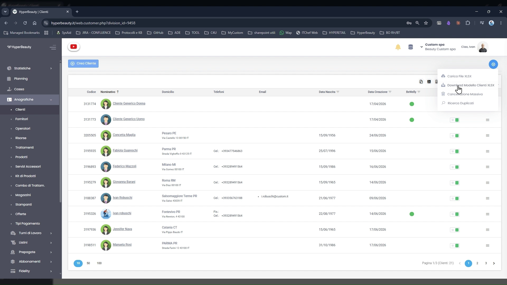

# Anagrafica Clienti

L'anagrafica clienti è il registro centrale di tutti i clienti del salone. Ogni cliente ha una scheda che raccoglie dati anagrafici, contatti, consensi e storico degli appuntamenti e degli acquisti. Una scheda ben compilata — soprattutto con telefono e consenso comunicazioni — è il prerequisito per tutta l'automazione dei messaggi.

---

<video controls width="100%" style="border-radius:8px; margin-bottom:1.5rem;">
  <source src="../assets/resources/clienti.mp4" type="video/mp4">
</video>

---

## La lista clienti

**Percorso:** Menu laterale → **Anagrafiche** → **Clienti**

La schermata elenca tutti i clienti della sede. Le colonne principali:

| Colonna | Descrizione |
|---------|-------------|
| **Codice** | Identificativo numerico univoco assegnato automaticamente |
| **Nominativo** | Nome e cognome del cliente, con foto profilo se caricata |
| **Telefono** | Numero primario — usato per WhatsApp |
| **Email** | Indirizzo email per le comunicazioni scritte |
| **Data Nascita** | Usata per gli auguri automatici |
| **Data Creazione** | Quando è stata creata la scheda |
| **Attivo** | Toggle per disattivare temporaneamente il cliente |

Per creare un nuovo cliente cliccare **+ Crea Cliente** in alto a sinistra.

---

## I clienti generici (pre-caricati)

Le prime due righe della lista mostrano sempre **Cliente Generico Donna** e **Cliente Generico Uomo** — clienti pre-caricati dal sistema, non modificabili e non cancellabili.

Servono per gestire i clienti di passaggio a cui non si vuole creare un'anagrafica: cliente occasionale, turista, walk-in. Si selezionano direttamente in cassa per procedere all'incasso senza creare nessun appuntamento né scheda personale.

!!! tip "Chi li usa di più"
    Barbershop in zone di transito, parrucchieri in zone mare con turisti stagionali, saloni in gallerie commerciali. Per qualsiasi cliente che non tornerà regolarmente, il cliente generico è la scelta più rapida.

---

## Creare un nuovo cliente

**Percorso:** Anagrafiche → Clienti → **+ Crea Cliente**

Il form si apre in una schermata dedicata con tre sezioni principali.

### Dati Anagrafici

| Campo | Note |
|-------|------|
| **Nome** | Obbligatorio |
| **Cognome** | Obbligatorio |
| **Alias** | Nome alternativo (es. soprannome usato in salone) |
| **Sesso** | Femmina / Maschio / Non specificato |
| **Data di nascita** | Consigliato — abilita gli auguri automatici |
| **Indirizzo, CAP, Provincia, Nazione** | Facoltativi — utili se si emettono fatture |

---

### Autorizzazioni Comunicazione ⭐

Questa è la sezione più importante da non saltare. HyperBeauty gestisce tre tipi di comunicazione, ciascuno con i propri canali:

| Tipo | Descrizione |
|------|-------------|
| **Al Servizio** | Comunicazioni operative: conferma appuntamento, promemoria, disdetta |
| **Commerciale dal Salone** | Promozioni e offerte del salone (es. campagna fidelity) |
| **Commerciale da Terzi** | Marketing da partner esterni (normalmente lasciare disattivato) |

Per ciascun tipo è possibile attivare o disattivare singolarmente i canali **WhatsApp**, **Email** e **SMS**.

!!! warning "⭐ Il flag consenso è il prerequisito assoluto"
    Senza almeno il consenso **Al Servizio** attivo, HyperBeauty **non invierà nessun messaggio automatico** a questo cliente — nemmeno la conferma dell'appuntamento. Non importa se il telefono è inserito correttamente: senza consenso, il sistema non comunica.

    Questo flag rappresenta il consenso del cliente ai sensi del GDPR. È obbligatorio ottenerlo prima di attivarlo — il salone è responsabile della raccolta del consenso.

Più in basso nella stessa sezione si inseriscono i contatti:

- **Email** — campo con pulsante **+ Aggiungi email** (è possibile inserirne più di una)
- **Telefono** — campo con pulsante **+ Aggiungi telefono** (numero primario = quello usato per WhatsApp)

---

### Dati Fiscali e Operativi

Campi per la fatturazione e la gestione avanzata:

| Campo | Note |
|-------|------|
| **Codice Fiscale** | Per emissione fattura o scontrino intestato |
| **Partita IVA** | Se il cliente è un'azienda |
| **Professione** | Campo libero — utile per i report di segmentazione |
| **Attività / Associazione** | Per clienti corporate o convenzioni |
| **Origine** | Come ha conosciuto il salone (passaparola, social, ecc.) |
| **Note Fatturazione** | Istruzioni specifiche per i documenti fiscali |

Per un inserimento base questi campi si lasciano vuoti e si completano al bisogno.

Cliccare **SALVA** per confermare. Il cliente è immediatamente disponibile per prenotare un appuntamento o per la cassa.

---

## Import massivo clienti

Per i saloni che migrano da un altro gestionale, HyperBeauty permette l'import massivo dell'anagrafica clienti tramite file CSV.

Dal menu ingranaggio ⚙️ in alto a destra nella lista clienti sono disponibili le opzioni:

- **Scarica modello CSV** — scarica il file template con le colonne corrette da compilare
- **Importa Clienti** — carica il file CSV compilato per l'import massivo
- **Esporta CSV** — esporta la lista clienti corrente in formato CSV

!!! info "Import massivo — Webinar 2"
    La procedura completa di import clienti da un'anagrafica esistente, con mappatura dei campi e gestione degli errori, è trattata in dettaglio nel Webinar 2. Per ora è sufficiente sapere che la funzione esiste e dove trovarla.

---

## Vendita senza appuntamento

Non è obbligatorio creare un appuntamento per incassare. È possibile andare direttamente in **Cassa**, selezionare il cliente (o il cliente generico), aggiungere il trattamento o il prodotto e procedere all'incasso — senza nessun blocco in agenda.

Utile per: vendita prodotto al banco, servizio rapido non prenotato, cliente walk-in.

---

## Riepilogo creazione cliente

| Passo | Azione | Obbligatorio |
|-------|--------|:---:|
| 1 | Anagrafiche → Clienti → + Crea Cliente | ✅ |
| 2 | Inserire Nome e Cognome | ✅ |
| 3 | Inserire Numero di Telefono | ✅ |
| 4 | Attivare consenso **Al Servizio** (WhatsApp/SMS/Email) | ✅ |
| 5 | Inserire Data di Nascita | ⚪ Consigliato |
| 6 | Inserire Email | ⚪ Consigliato |
| 7 | Cliccare SALVA | ✅ |

---

*Documento a cura di Custom S.p.a. — HyperBeauty Training Program — Versione 1.0 — Giugno 2026*
