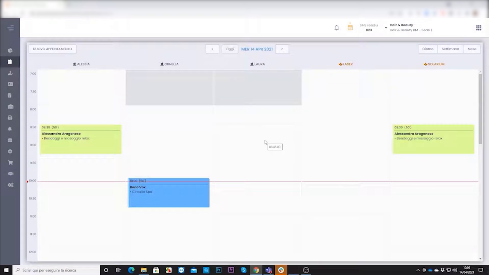
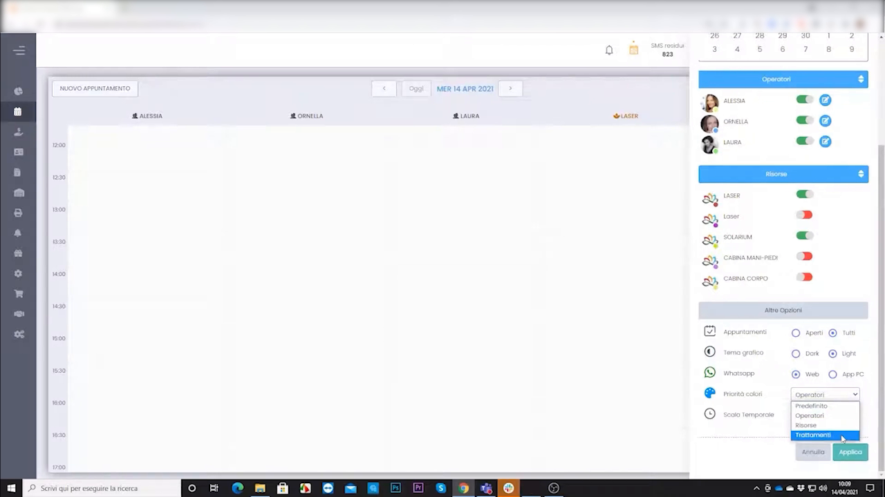
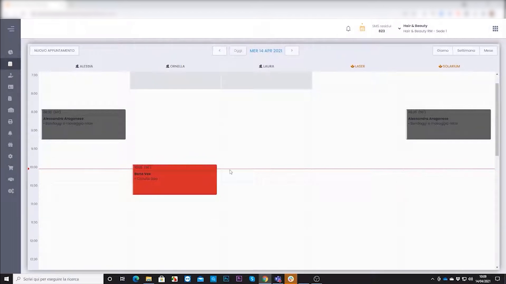
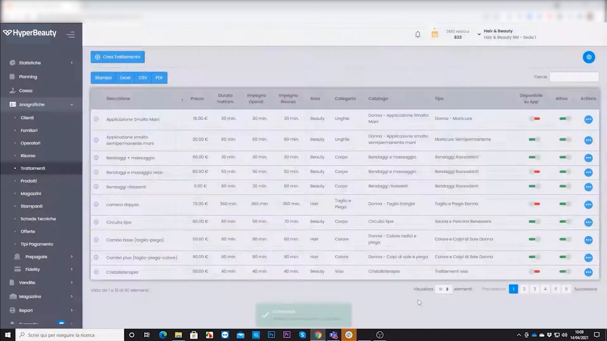

# Colorazione dei Trattamenti in Agenda

HyperBeauty permette di scegliere come colorare i blocchi appuntamento nel Planning: per **operatore** (ogni operatore ha il suo colore) oppure per **trattamento** (ogni servizio ha un colore distinto). Questa impostazione è utile per leggere l'agenda a colpo d'occhio e capire immediatamente quali servizi sono in corso durante la giornata.

---

<video controls width="100%" style="border-radius:8px; margin-bottom:1.5rem;">
  <source src="../assets/resources/25_colorazione_dei_trattamenti_in_agenda.mp4" type="video/mp4">
</video>

---

## Modalità di colorazione disponibili

Per impostazione predefinita il Planning usa la colorazione **per Operatore**: ogni operatore ha un colore assegnato e tutti i suoi appuntamenti appaiono in quel colore. Nell'esempio, gli appuntamenti di Alessia sono verdi, quelli di Ornella sono blu.

È possibile passare alla colorazione **per Trattamento**: ogni tipologia di servizio (es. Bendaggi, Circuito Spa, Colorazione) ha un colore proprio, indipendentemente dall'operatore che lo esegue.

---

## Cambiare la modalità di colorazione

**Percorso:** Planning → icona **⚙️ ingranaggio** in alto a destra → **Altre Opzioni**

Nella sezione **Altre Opzioni** del pannello laterale, trovare la voce **Mostra colore** con il menu a tendina. Le opzioni disponibili sono:

| Opzione | Descrizione |
|---------|-------------|
| **Operatori** | I blocchi appuntamento prendono il colore dell'operatore assegnato |
| **Trattamenti** | I blocchi appuntamento prendono il colore del trattamento prenotato |

Selezionare **Trattamenti** e cliccare **APPLICA**.

---

## Risultato in agenda

Dopo aver applicato la modalità **Trattamenti**, i blocchi in agenda cambiano colore in base al servizio:

- Gli appuntamenti "Bendaggi e massaggio relax" appaiono in **grigio**
- L'appuntamento "Circuito Spa" appare in **rosso**

Il cambio è immediato e riguarda tutti gli appuntamenti visibili nel Planning.

---

## Configurare il colore di un trattamento

I colori dei trattamenti si impostano direttamente nell'anagrafica dei trattamenti.

**Percorso:** Menu laterale → **Anagrafiche** → **Trattamenti**

Nell'elenco dei trattamenti, ogni riga mostra un indicatore colorato sulla destra. Per modificare il colore di un trattamento: aprire il trattamento in modifica e selezionare il colore desiderato dal selettore cromatico.

!!! tip "Scegliere colori distinti"
    Assegnare colori ben distinti ai trattamenti più frequenti (es. colorazione, taglio, trattamento viso) rende l'agenda immediatamente leggibile — anche con molti appuntamenti nella stessa giornata.

---

## Riepilogo

| Passo | Azione | Dove |
|-------|--------|------|
| 1 | Assegnare un colore a ogni trattamento | Anagrafiche → Trattamenti |
| 2 | Aprire le opzioni del Planning | Planning → ⚙️ |
| 3 | Impostare **Mostra colore = Trattamenti** | Altre Opzioni → APPLICA |
| 4 | Verificare i colori in agenda | Planning |

---

*Documento a cura di Custom S.p.a. — HyperBeauty Training Program — Versione 1.0 — Giugno 2026*
