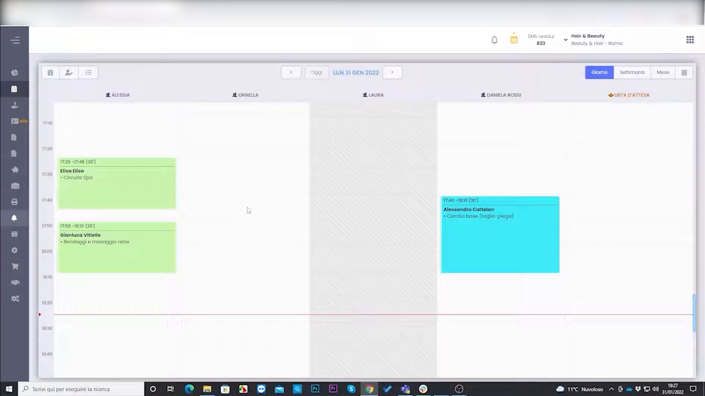
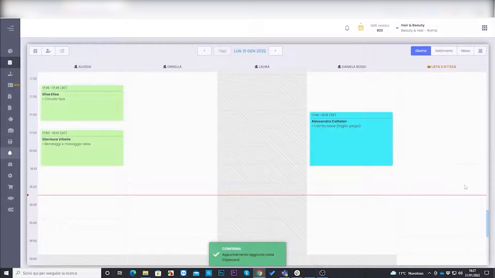
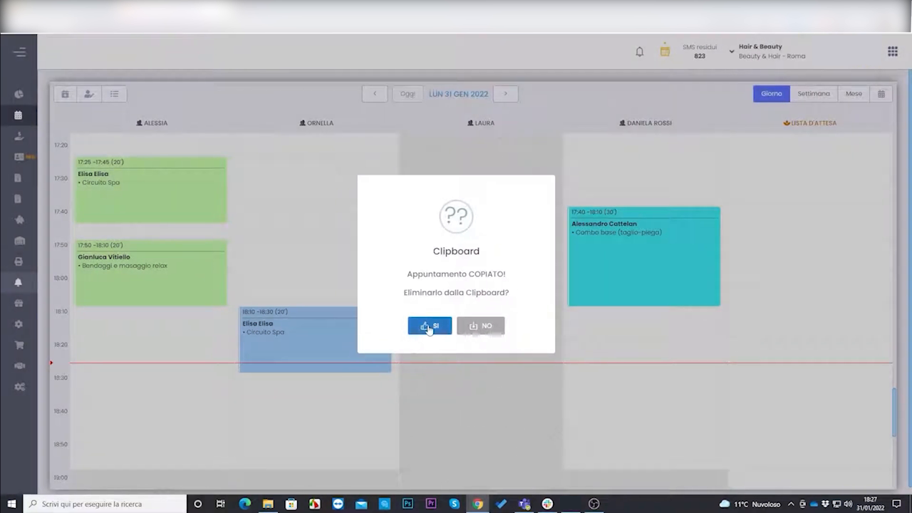
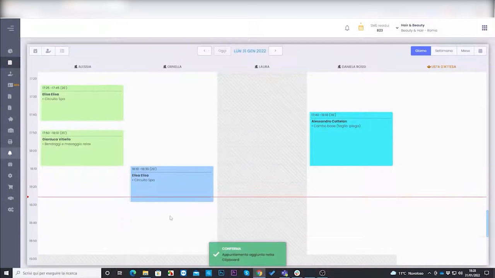
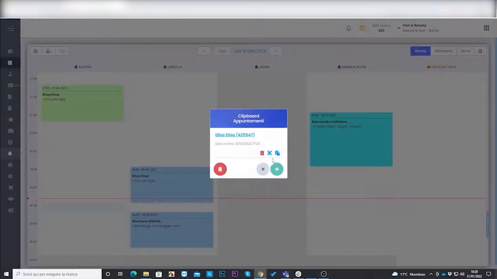
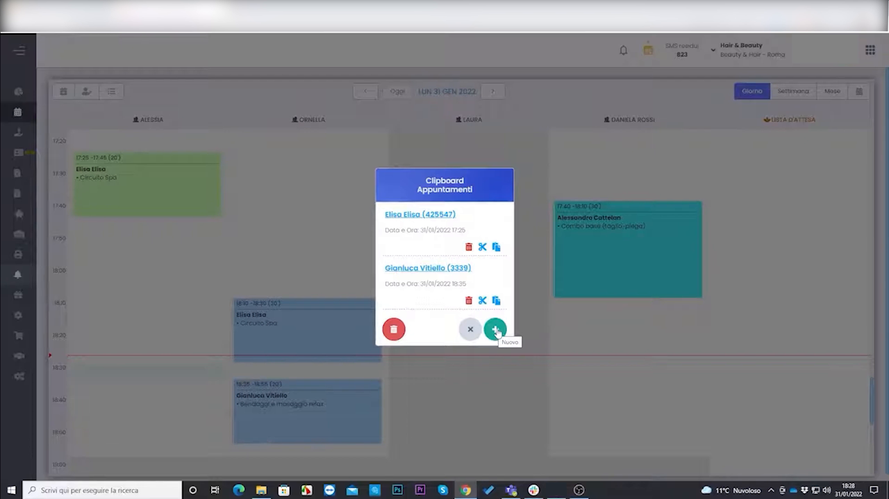

# Copia, Incolla e Sposta Appuntamenti in Agenda

HyperBeauty consente di copiare e spostare appuntamenti nel Planning senza doverli cancellare e ricreare. Il sistema usa una **Clipboard Appuntamenti** che può contenere più appuntamenti contemporaneamente, permettendo di incollarli in qualsiasi data, orario o colonna operatore.

---

<video controls width="100%" style="border-radius:8px; margin-bottom:1.5rem;">
  <source src="../assets/resources/35_copia_incolla_sposta_appuntamenti_in_agenda.mp4" type="video/mp4">
</video>

---

## Stato iniziale del Planning

Il Planning mostra gli appuntamenti nelle rispettive colonne operatore. Per copiare o spostare un appuntamento, agire direttamente sul blocco in agenda.

---

## Copiare un appuntamento nella Clipboard

Per copiare un appuntamento: fare **clic destro** sul blocco appuntamento in agenda e selezionare l'azione di copia (oppure usare l'azione specifica dalla finestra dettaglio appuntamento).

Il sistema conferma l'operazione con un toast verde in basso:

> ✅ *"Appuntamento aggiunto nella Clipboard"*

L'appuntamento originale rimane in agenda — è stato copiato, non spostato.

---

## Incollare l'appuntamento in una nuova posizione

Cliccare sulla fascia oraria di destinazione nella colonna dell'operatore desiderato. Il gestionale incolla l'appuntamento nella nuova posizione e mostra una finestra di dialogo:

> **Clipboard**
> Appuntamento COPIATO!
> Eliminarlo dalla Clipboard?

| Risposta | Effetto |
|----------|---------|
| **SÌ** | L'appuntamento viene rimosso dalla clipboard dopo l'incolla (comportamento "taglia e incolla") |
| **NO** | L'appuntamento rimane in clipboard — può essere incollato di nuovo in altri slot o date |

---

## Risultato dell'incolla

Il blocco appuntamento appare nella nuova posizione (colonna e orario di destinazione). Se si è scelto **NO** alla domanda precedente, la clipboard mantiene ancora l'appuntamento disponibile per ulteriori incollii.

!!! tip "Spostare un appuntamento"
    Per **spostare** (anziché duplicare) un appuntamento: copiarlo in clipboard → incollarlo nella nuova posizione → rispondere **SÌ** alla rimozione dalla clipboard. Il blocco originale può poi essere eliminato manualmente, oppure usare la funzione di spostamento diretto se disponibile.

---

## Gestire la Clipboard Appuntamenti

Cliccando sull'icona **Clipboard** nella toolbar del Planning si apre il pannello **Clipboard Appuntamenti**, che mostra tutti gli appuntamenti attualmente in attesa di essere incollati.

Per ogni appuntamento in clipboard sono disponibili le azioni:

| Icona | Azione |
|-------|--------|
| 🟩 **+** verde | Incolla l'appuntamento nello slot selezionato |
| ✏️ | Modifica i dettagli prima di incollare |
| ❌ | Rimuove l'appuntamento dalla clipboard |

---

## Clipboard con più appuntamenti

La Clipboard può contenere **più appuntamenti contemporaneamente**. Nell'esempio sono presenti due appuntamenti (Elisa Elive e Gianluca Vitello), ciascuno con i propri dati originali (data/ora di partenza) e i relativi pulsanti di azione.

Il pulsante rosso 🔴 in basso svuota l'intera clipboard in un colpo solo.

!!! info "Utilizzo tipico con più appuntamenti"
    Questa funzionalità è utile quando un operatore è assente e si devono redistribuire più appuntamenti ad altri colleghi: copiare tutti gli appuntamenti in clipboard, poi incollarli uno a uno sulle colonne degli operatori disponibili.

---

## Riepilogo operazioni

| Operazione | Come si fa |
|------------|-----------|
| **Copia** | Clic destro sul blocco → Copia in clipboard |
| **Incolla** | Clic su slot di destinazione → conferma |
| **Sposta** | Copia → Incolla → SÌ alla rimozione dalla clipboard |
| **Multi-incolla** | Copia → Incolla → NO alla rimozione → incolla di nuovo altrove |
| **Gestione clipboard** | Icona Clipboard in toolbar → pannello con tutti gli appuntamenti in attesa |
| **Svuota clipboard** | Pulsante rosso nel pannello Clipboard |

---

*Documento a cura di Custom S.p.a. — HyperBeauty Training Program — Versione 1.0 — Giugno 2026*
