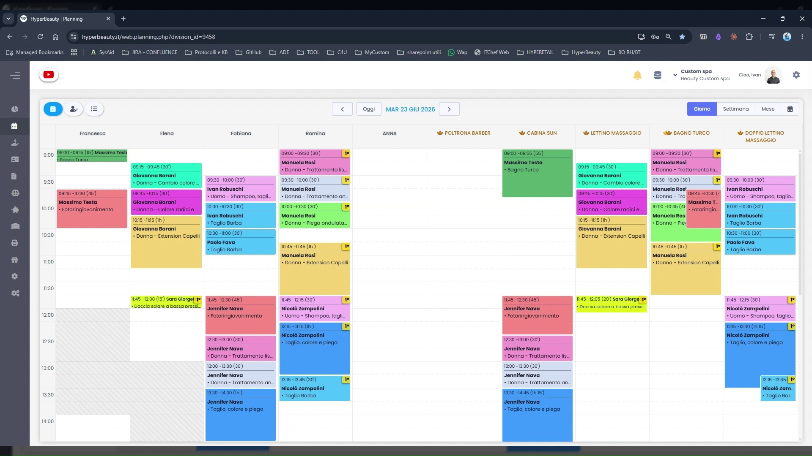
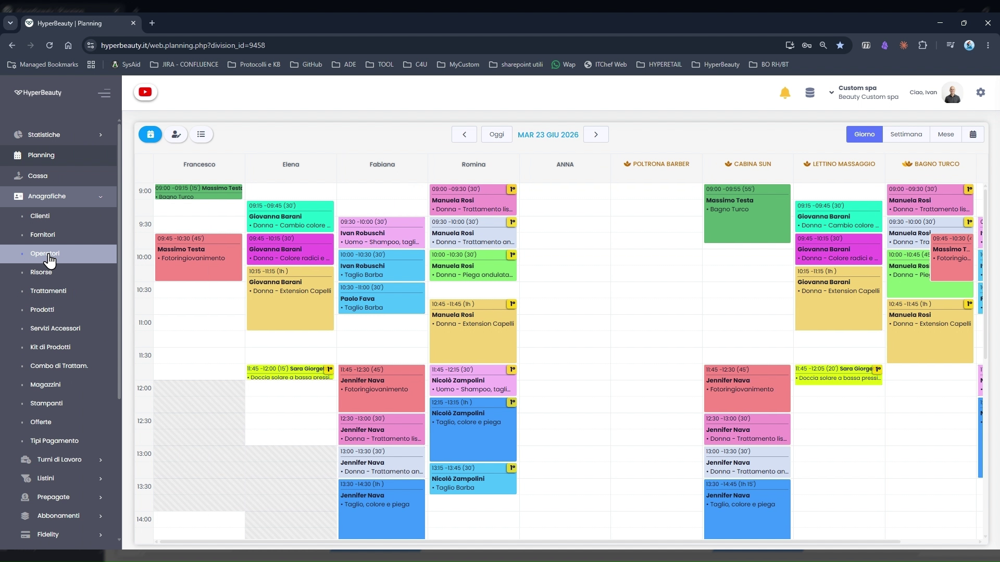
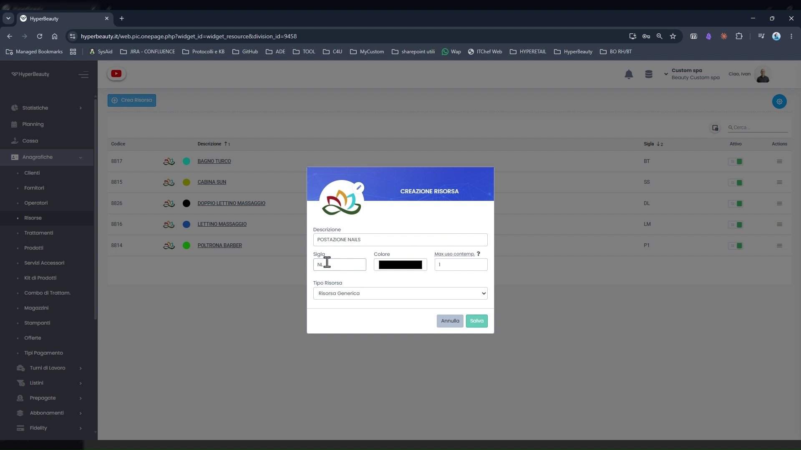
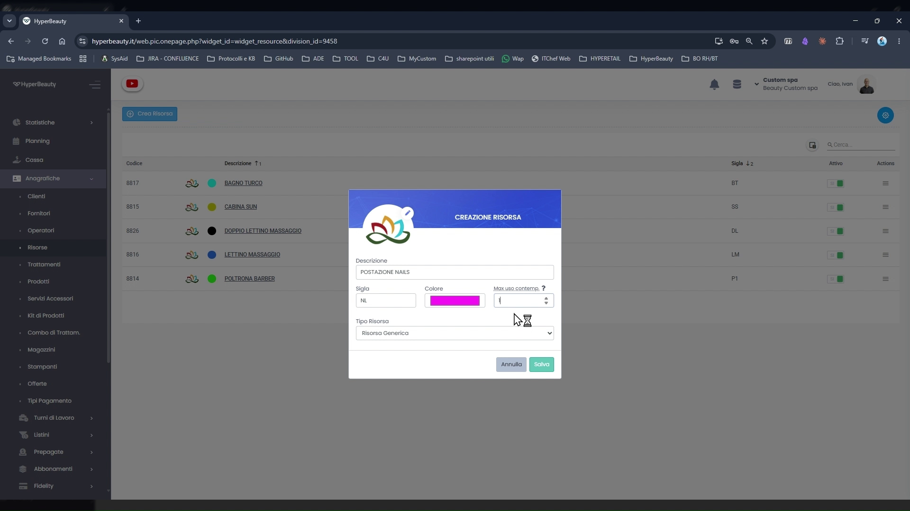

# Gestione Risorse

Le risorse sono le **entità fisiche** che supportano l'erogazione dei trattamenti: cabine, lettini, postazioni, macchinari e attrezzature specifiche. Configurarle permette a HyperBeauty di gestire la disponibilità degli spazi fisici del salone, evitando doppi utilizzi e conflitti di agenda.

---

<video controls width="100%" style="border-radius:8px; margin-bottom:1.5rem;">
  <source src="../assets/resources/risorsa.mp4" type="video/mp4">
</video>

---

## Le risorse in agenda

Le risorse configurate compaiono come **colonne aggiuntive nel Planning**, affiancate alle colonne degli operatori. Questo permette di vedere a colpo d'occhio quali spazi fisici sono occupati in ogni fascia oraria.

---

## La lista risorse

**Percorso:** Menu laterale → **Anagrafiche** → **Risorse**

La schermata elenca tutte le risorse configurate per la sede. Per ciascuna sono visibili:

| Colonna | Descrizione |
|---------|-------------|
| **Codice** | Identificativo numerico univoco assegnato automaticamente |
| **Descrizione** | Nome della risorsa come appare in agenda |
| **Sigla** | Abbreviazione (2-3 lettere) usata nei report |
| **Attivo** | Toggle per disabilitare temporaneamente la risorsa |

Esempio di risorse già configurate in sede:

| Descrizione | Sigla | Note |
|-------------|-------|------|
| Bagno Turco | BT | |
| Cabina Sun | SS | |
| Doppio Lettino Massaggio | DL | Uso contemporaneo = 2 |
| Lettino Massaggio | LM | |
| Poltrona Barbieri | P1 | |

Per creare una nuova risorsa cliccare **+ Crea Risorsa** in alto a sinistra.

---

## Creare una nuova risorsa

**Percorso:** Anagrafiche → Risorse → **+ Crea Risorsa**

Il pannello di creazione contiene tutti i campi necessari:

| Campo | Descrizione |
|-------|-------------|
| **Descrizione** | Nome della risorsa (es. "Cabina 1", "Lettino Massaggi", "Postazione Nails") |
| **Sigla** | 2-3 lettere per i report (es. C1, LM, NL) |
| **Colore** | Colore identificativo in agenda — scegliere uno diverso per ogni risorsa |
| **Max uso contemp.** | Quante persone possono usare la risorsa contemporaneamente |
| **Tipo Risorsa** | Generalmente "Risorsa Generica" per la maggior parte dei casi |

Cliccare **Salva** per confermare. La risorsa appare immediatamente come nuova colonna in agenda.

---

## Uso contemporaneo — campo chiave

Il campo **Max uso contemp.** è il parametro più importante della configurazione risorsa. Determina quante persone possono utilizzare quello spazio nello stesso momento.

| Valore | Comportamento in agenda |
|--------|------------------------|
| **1** *(default)* | Un solo appuntamento alla volta. Quando occupata mostra il classico "pieno". |
| **> 1** | Mostra **"1 di N"**, **"2 di N"** ecc. Il simbolo "occupato" appare solo a capacità massima raggiunta. |

**Casi d'uso tipici:**

- **Cabina con 2 lettini** → Max uso contemp. = 2. In agenda: "Doppio Lettino 1 di 2" / "2 di 2".
- **Zona relax SPA con 4 posti** → Max uso contemp. = 4. Fino al 4° ospite la risorsa è ancora prenotabile.
- **Piscina interna** → Max uso contemp. = 10 (numero massimo di persone ammesse).

!!! info "Quando usare valori > 1"
    Questa funzione è particolarmente utile per SPA, centri benessere e strutture con spazi condivisi. Per un salone tradizionale con cabine singole il valore **1** è sempre corretto.

---

## Risorse e operatori

Le risorse sono indipendenti dagli operatori, ma la loro disponibilità è influenzata dagli operatori che le utilizzano. Se un operatore assegnato a una cabina è assente, quella combinazione non è prenotabile — anche se la cabina fisicamente è libera.

!!! warning "Completare la configurazione prima degli appuntamenti"
    Una risorsa configurata in modo errato può generare doppie prenotazioni sullo stesso spazio fisico. Completare sempre la configurazione risorse prima di inserire appuntamenti reali nel gestionale.

---

## Limite di piano

!!! warning "Tutti i piani HyperBeauty: massimo 6 operatori + 6 risorse"
    **Tutti i piani HyperBeauty** includono fino a **6 risorse**. Per aggiungerne altre, attivare il modulo opzionale **"3 o 6 Operatori/Risorse aggiuntive"** acquistabile da **Custom4U**.

    Per i saloni piccoli con una o due cabine il limite non è mai un problema. Per centri con molte postazioni, verificare il numero prima dell'installazione.

---

## Riepilogo configurazione risorsa

| Passo | Azione | Obbligatorio |
|-------|--------|:---:|
| 1 | Anagrafiche → Risorse → + Crea Risorsa | ✅ |
| 2 | Inserire descrizione e sigla | ✅ |
| 3 | Scegliere colore univoco | ✅ |
| 4 | Impostare Max uso contemp. (1 per cabine singole, >1 per spazi condivisi) | ✅ |
| 5 | Salvare e verificare la colonna in Planning | ✅ |

---

*Documento a cura di Custom S.p.a. — HyperBeauty Training Program — Versione 1.0 — Giugno 2026*
