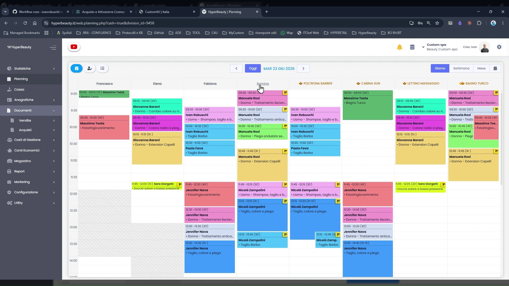
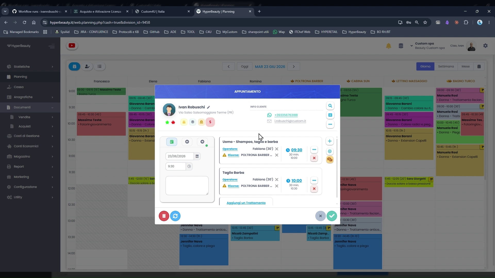
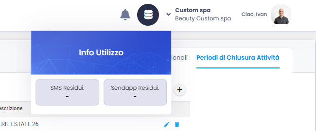
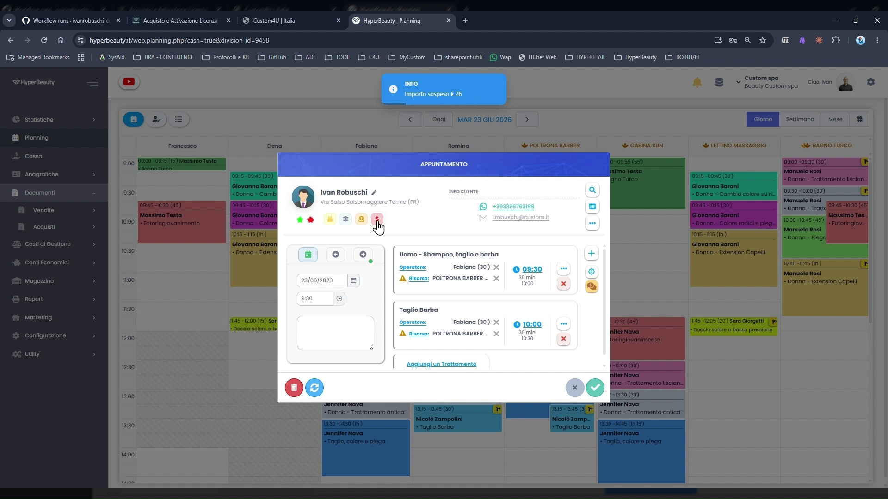
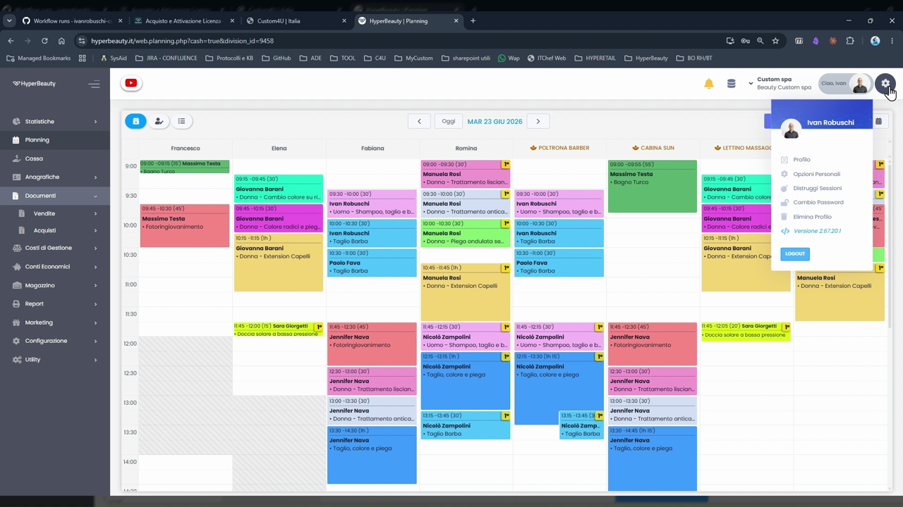
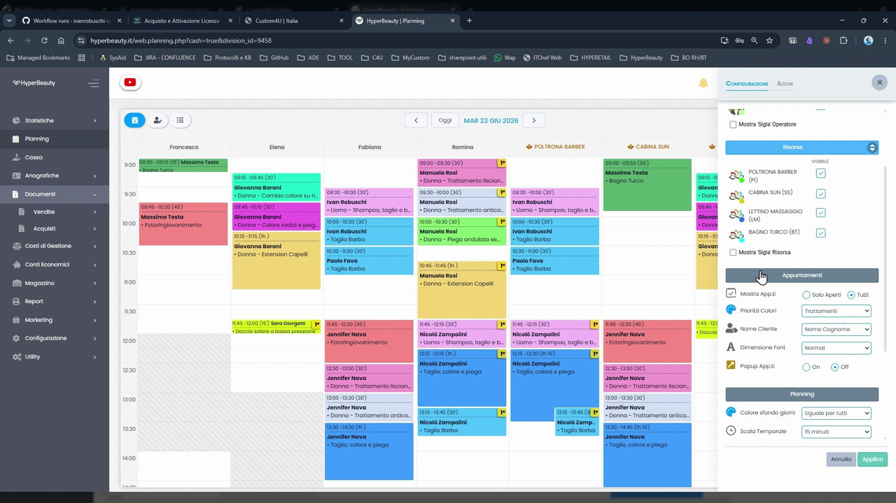

# Orientamento nell'Interfaccia

Prima di toccare qualsiasi impostazione, questo modulo guida il dealer in un tour dell'interfaccia HyperBeauty per acquisire subito familiarità con la struttura del gestionale.

---

<video controls width="100%" style="border-radius:8px; margin-bottom:1.5rem;">
  <source src="../assets/resources/interfaccia.mp4" type="video/mp4">
</video>

---

## La schermata principale — Planning

All'accesso, HyperBeauty apre direttamente la vista **Planning**, il cuore operativo del gestionale. Da qui si gestisce l'intera agenda del centro.

La schermata è composta da tre aree principali:

| Area | Posizione | Funzione |
|------|-----------|----------|
| **Menu laterale sinistro** | Sinistra | Navigazione tra i moduli del gestionale |
| **Area di lavoro centrale** | Centro | Contenuto della sezione attiva (agenda, liste, form) |
| **Barra superiore** | In alto | Navigazione temporale, ricerca, account e guida |

---

## Menu laterale sinistro

Il menu laterale è sempre visibile e permette di passare istantaneamente da un modulo all'altro. Le voci disponibili (dall'alto verso il basso):

- **Statistiche** — dashboard con i principali KPI del centro
- **Planning** — agenda appuntamenti (vista corrente)
- **Cassa** — gestione incassi, documenti fiscali e sospesi
- **Anagrafiche** — clienti, operatori, trattamenti, prodotti, risorse
- **Vendite** — storico documenti commerciali emessi
- **Acquisti** — registrazione fatture fornitori (modulo magazzino)
- **Costi di Gestione** — spese operative del centro
- **Conti Economici** — bilancio e analisi economica
- **Magazzino** — giacenze prodotti e movimentazioni
- **Report** — estrazioni e analisi personalizzate
- **Supporto** — apertura ticket e accesso alla guida video integrata
- **Marketing** — campagne, automatismi e comunicazioni clienti
- **Impostazioni** — configurazione sede, stampanti, operatori
- **Shop** — acquisto moduli aggiuntivi e servizi
- **Utility** — strumenti di servizio e import/export dati

!!! tip "Navigazione rapida"
    Cliccare su qualsiasi voce del menu porta direttamente alla sezione corrispondente senza ricaricare la pagina — HyperBeauty è un'applicazione cloud a navigazione istantanea.

---

## Barra superiore

La barra superiore è presente in tutte le sezioni del gestionale e contiene gli elementi di controllo globali.

**Elementi principali (da sinistra a destra):**

- **Frecce di navigazione temporale** (`‹` `›`) — scorrono la settimana in agenda avanti o indietro
- **Data corrente** — mostra il periodo visualizzato; cliccabile per saltare a una data specifica
- **"Oggi"** — riporta immediatamente alla settimana corrente
- **Icona ingranaggio** ⚙️ — opzioni Planning (tema, scala temporale, ordine operatori)
- **Icona notifiche** 🔔 — avvisi di sistema e riepilog appuntamenti della giornata
- **Icona database**  — cliccando sull'icona visualizza i contatori sms ed i messaggi whatsapp rimanenti se attivati con apposito modulo

- **Pulsante "Ciao [nome]"** 👤 — menu account (dati personali, cambio password, selezione sede,recupero password)

---

## Icone cliente in agenda

Le **icone colorate** che compaiono su ogni cliente in agenda e in cassa comunicano immediatamente la situazione economica e commerciale, senza aprire la scheda anagrafica.

Cliccando su un appuntamento in agenda si apre il pannello del cliente con le icone in evidenza:

### Significato delle icone

| Icona | Colore | Significato |
|-------|--------|-------------|
| **$** | 🔴 Rosso lampeggiante | Il cliente ha un **sospeso aperto**. Cliccando sull'icona appare l'importo esatto (es. "Sospeso: €59,00") |
| **Carta prepagata** | 🟠 Arancione | Ha una **prepagata attiva** con credito residuo da scalare |
| **Fogliettini** | 🟢 Verde | Ha un **abbonamento attivo** con sedute residue ancora da utilizzare |
| **Torta** 🎂 | — | Oggi è il **compleanno** del cliente |
| **Salvadanaio** 🐷 | Rosso / Giallo / Verde | **Indicatore economico** — valore del cliente nel tempo |

!!! success "Il momento 'wow'"
    Mostrare queste icone su un cliente demo con sospeso aperto è il momento di maggiore impatto del corso. Il dealer capisce immediatamente il valore operativo: **in qualsiasi punto del gestionale** (agenda, cassa, anagrafica) viene sempre avvisato della situazione del cliente prima di iniziare il servizio.

!!! info "Icone visibili ovunque"
    Le icone compaiono sia in **Planning** che in **Cassa** — il centro è sempre informato, indipendentemente da dove opera nel gestionale.

---

## Menu account — pulsante "Ciao"

In alto a destra, il pulsante **"Ciao [nome utente]"** apre il menu personale dell'account.

**Opzioni disponibili:**

- **Dati personali** — modifica nome, email e informazioni dell'account
- **Cambia password** — aggiornamento della password di accesso
- **Seleziona sede** — cambio rapido tra sedi (installazioni multi-sede)
- **Distruggi sessioni** — invalida immediatamente tutti gli accessi attivi su altri dispositivi; utile in caso di sessione lasciata aperta su un PC del cliente o accesso non autorizzato sospetto
- **Esci** — logout dall'applicazione

!!! warning "Multi-sede"
    Se il centro gestisce più sedi, ogni sede va gestita in una **scheda browser separata** — non tentare di gestire più sedi nella stessa scheda per evitare di operare sulla sede sbagliata.

---

## Guida Video Integrata

HyperBeauty include una libreria di **68 video-guide** sempre accessibile durante l'utilizzo, senza mai abbandonare il gestionale.

**Come accedervi:** icona 🎬 nella barra superiore, oppure **Supporto** nel menu laterale.

Le 68 guide sono organizzate in **10 sezioni tematiche** e coprono tutte le funzionalità del gestionale. Un campo di ricerca interno permette di trovare rapidamente la guida cercata digitando una parola chiave.

!!! tip "Prima di aprire un ticket"
    Prima di contattare il supporto Custom, consultare la Guida Video Integrata. La maggior parte delle situazioni operative comuni è già documentata in formato video.

---

## Riepilogo dell'interfaccia

| Elemento | Dove si trova | Uso principale |
|----------|---------------|----------------|
| Menu laterale | Sinistra, fisso | Navigare tra i moduli |
| Planning | Area centrale | Gestire l'agenda |
| Barra superiore | In alto | Navigazione temporale e controlli globali |
| Icone cliente | Su ogni cliente in agenda e cassa | Situazione economica a colpo d'occhio |
| Pulsante "Ciao" | In alto a destra | Account, password, cambio sede |
| Guida video 🎬 | In alto a destra | 68 video-guide sempre accessibili |

---

*Documento a cura di Custom S.p.a. — HyperBeauty Training Program — Versione 1.0 — Giugno 2026*
