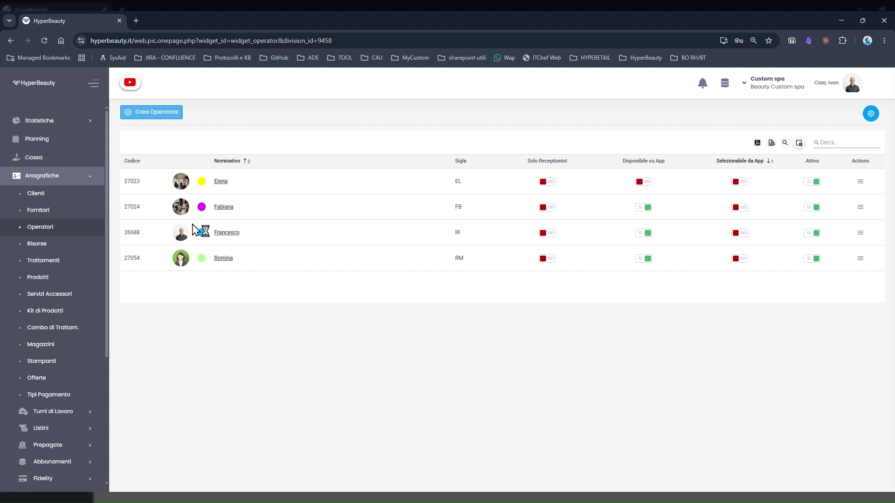
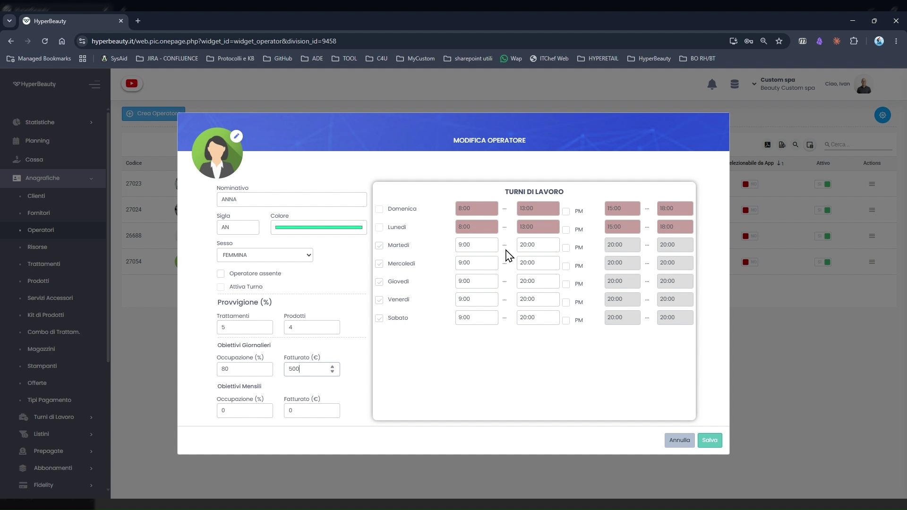
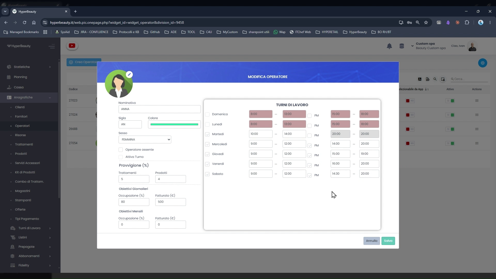
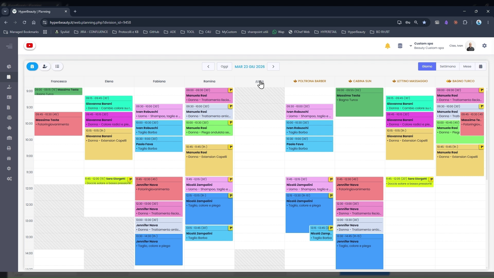

# Creazione e Configurazione Operatori

Gli operatori sono le persone che erogano i trattamenti e compaiono come **colonne colorate nell'agenda**. Prima di poter creare appuntamenti è necessario configurare almeno un operatore con i propri orari di lavoro.

---

<video controls width="100%" style="border-radius:8px; margin-bottom:1.5rem;">
  <source src="../assets/resources/operatori.mp4" type="video/mp4">
</video>

---

## La lista operatori

**Percorso:** Menu laterale → **Anagrafiche** → **Operatori**

La schermata elenca tutti gli operatori configurati per la sede. Per ciascuno sono visibili:

| Colonna | Descrizione |
|---------|-------------|
| **Codice** | Identificativo numerico univoco assegnato automaticamente |
| **Nominativo** | Nome, foto profilo e pallino con il colore agenda |
| **Sigla** | Abbreviazione (2-3 lettere) usata nei report e nelle stampe |
| **Solo Receptionist** | Se attivo, l'operatore non compare come colonna in agenda ma può gestire prenotazioni |
| **Disponibile su App** | L'operatore è prenotabile dai clienti tramite l'app BeWelly |
| **Selezionabile da App** | I clienti possono scegliere specificamente questo operatore in fase di prenotazione online |
| **Attivo** | Toggle per disabilitare temporaneamente l'operatore senza eliminarlo |

Per creare un nuovo operatore cliccare il pulsante **+ Crea Operatore** in alto a sinistra.

---

## Dati anagrafici e colore

**Percorso:** Anagrafiche → Operatori → **+ Crea Operatore**

Il pannello di creazione/modifica è diviso in due sezioni: dati anagrafici a sinistra e turni di lavoro a destra.

### Campi principali (pannello sinistro)

| Campo | Note |
|-------|------|
| **Nome e Cognome** | Come appare in agenda e nei documenti |
| **Colore** | Selezionare un colore diverso per ogni operatore — è il colore della colonna in agenda |
| **Tipo** | Operatore (eroga trattamenti) o Receptionist (gestisce prenotazioni, non compare in agenda) |
| **Priorità** | Ordine di visualizzazione delle colonne in agenda (1 = prima colonna a sinistra) |
| **Sigla** | 2-3 lettere usate nei report (es. EL per Elena, FB per Fabiana) |
| **Operatore resoconto** | Operatore di riferimento per i report di gruppo |

!!! tip "Colori univoci"
    Assegnare a ogni operatore un colore diverso permette di riconoscere a colpo d'occhio chi è occupato e quando, senza leggere il nome. È una delle prime cose che i dealer mostrano ai clienti durante la demo.

---

## Turni di lavoro individuali

Il pannello destro della scheda operatore contiene la griglia **Turni di Lavoro**.

Per ogni giorno della settimana è possibile definire:

- **Checkbox giorno** — spuntare per abilitare il giorno lavorativo
- **Orario mattina** — ora di inizio e ora di fine turno mattutino
- **Checkbox PM** — abilitare il turno pomeridiano
- **Orario pomeriggio** — ora di inizio e ora di fine turno pomeridiano

!!! warning "Orari operatore vs orari sede"
    Gli orari dell'operatore definiscono la sua **disponibilità individuale** all'interno della finestra oraria della sede. Un operatore non può essere disponibile in fasce orarie in cui la sede è chiusa. Se ad esempio la sede apre alle 9:00, impostare un operatore dalle 8:00 non avrà effetto — l'agenda partirà comunque dall'orario di apertura sede.

**Esempio turno spezzato:**

| Giorno | Mattina | Pomeriggio |
|--------|---------|------------|
| Lunedì | 09:00 – 13:00 | 15:00 – 19:00 |
| Martedì | 09:00 – 13:00 | 15:00 – 19:00 |
| Mercoledì | 09:00 – 13:00 | — |
| Giovedì | 09:00 – 13:00 | 15:00 – 19:00 |
| Venerdì | 09:00 – 13:00 | 15:00 – 20:00 |
| Sabato | 09:00 – 18:00 | — |
| Domenica | — | — |

Cliccare **Salva** per confermare. L'operatore appare immediatamente come nuova colonna nell'agenda.

---

## Lista operatori aggiornata

Dopo aver creato tutti gli operatori, la lista mostra l'elenco completo con colori e sigle assegnate.

---

## Gli operatori in agenda

Una volta salvati, gli operatori compaiono come **colonne colorate nel Planning**. Ogni appuntamento viene associato a un operatore specifico e visualizzato nella sua colonna.

---

## Colori in agenda — due modalità

HyperBeauty supporta due modalità di colorazione degli appuntamenti, configurabili dall'icona ⚙️ nella barra superiore del Planning:

| Modalità | Descrizione | Tipico utilizzo |
|----------|-------------|-----------------|
| **Per operatore** *(default)* | L'appuntamento prende il colore dell'operatore. La colonna è monocromatica. | Centri estetici, SPA, istituti di bellezza |
| **Per tipo di trattamento** | L'appuntamento prende il colore del trattamento (es. colorazione = rosso, taglio = giallo, piega = verde). | Parrucchieri che vogliono vedere quanti trattamenti lunghi hanno in agenda |

!!! info "Come cambiare modalità"
    Planning → icona ⚙️ → sezione **Colori appuntamenti** → selezionare la modalità. La modifica è immediata.

---

## Aggiungere Moduli 3 o 6 operatori/risorse

!!! warning "Tutti i piani HyperBeauty: massimo 6 operatori + 6 risorse"
    **Tutti i piani HyperBeauty** includono fino a **6 operatori** e **6 risorse**. Se il salone ne ha di più, attivare il modulo opzionale **"3 o 6 Operatori/Risorse aggiuntive"** acquistabili da **Custom4U**.

    Verificare sempre il numero di operatori attivi del salone prima dell'installazione per evitare problemi in fase di configurazione.

---

## Riepilogo configurazione operatore

| Passo | Azione | Obbligatorio |
|-------|--------|:---:|
| 1 | Anagrafiche → Operatori → + Crea Operatore | ✅ |
| 2 | Inserire nome, scegliere colore univoco e sigla | ✅ |
| 3 | Impostare tipo (Operatore / Receptionist) | ✅ |
| 4 | Compilare turni di lavoro giornalieri | ✅ |
| 5 | Abilitare/disabilitare disponibilità su BeWelly | Facoltativo |
| 6 | Salvare e verificare la colonna in Planning | ✅ |

---

*Documento a cura di Custom S.p.a. — HyperBeauty Training Program — Versione 1.0 — Giugno 2026*
