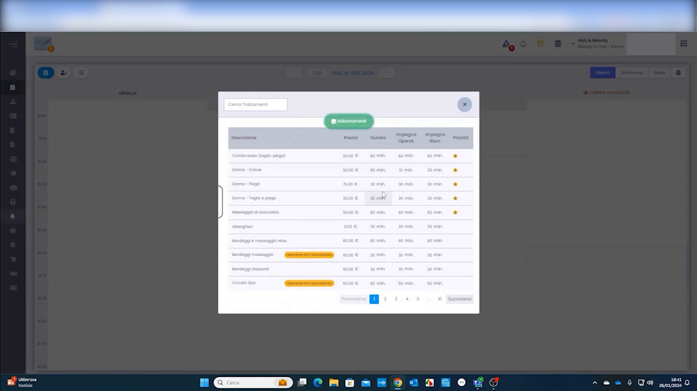
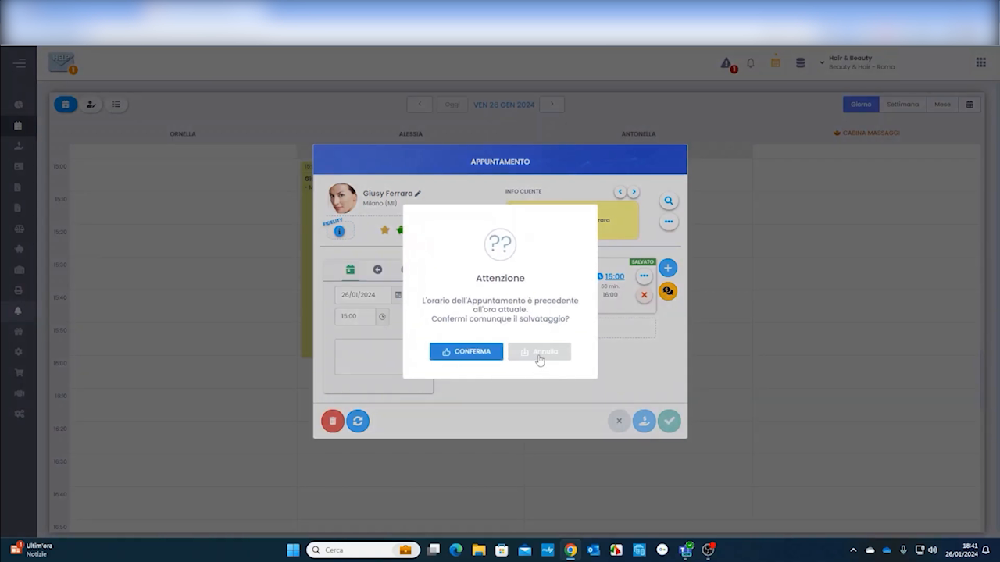
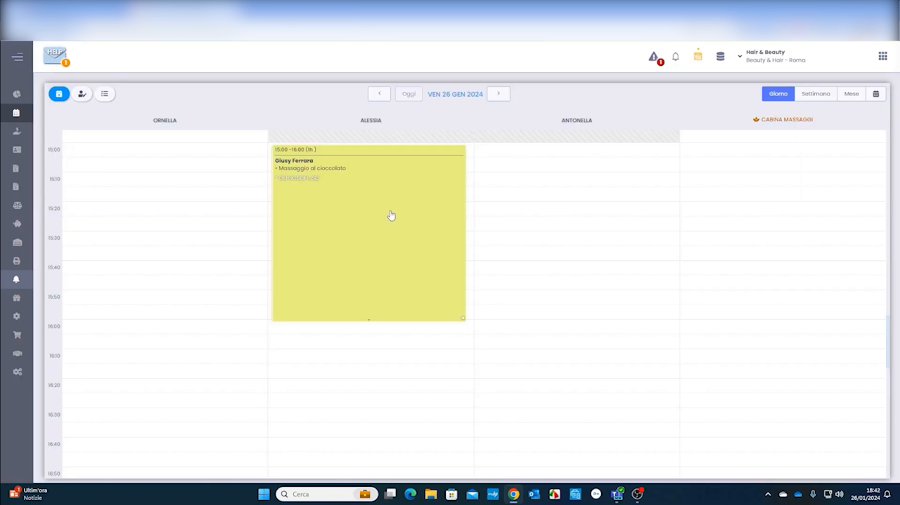
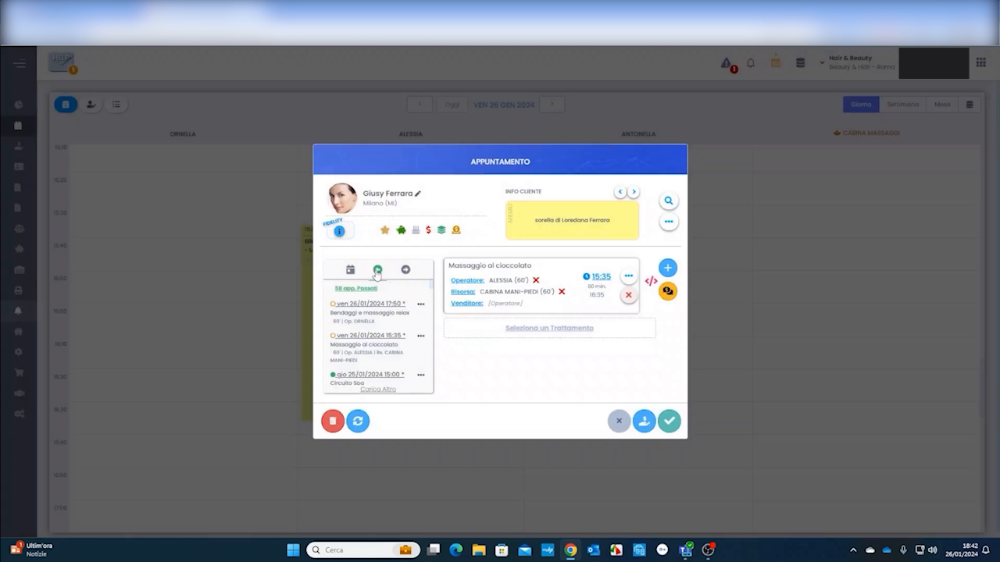
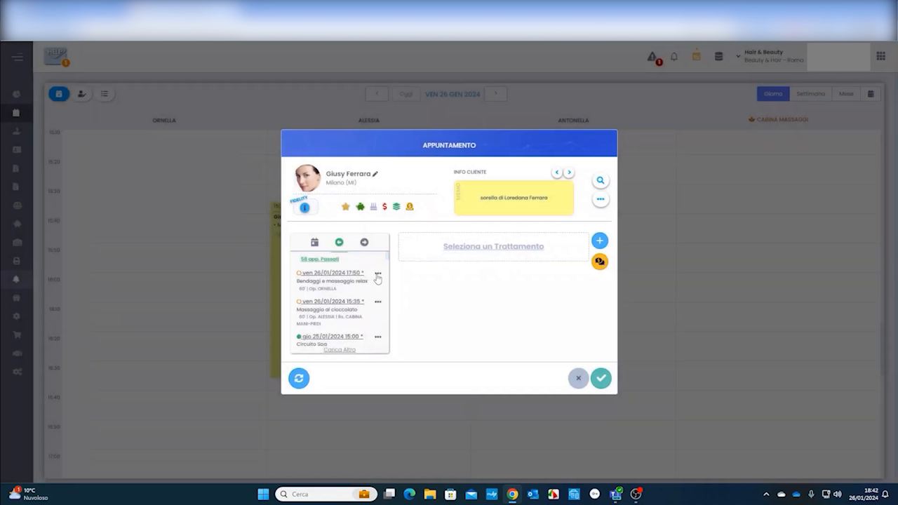
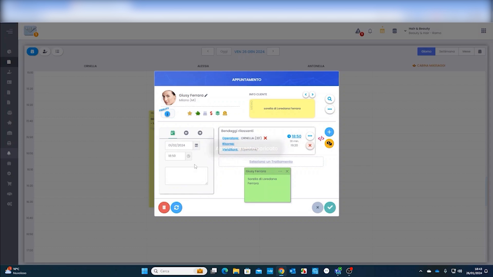

# Presa Appuntamento

La creazione di un appuntamento è l'operazione più frequente in HyperBeauty. Dal Planning è possibile prenotare un cliente in pochi secondi: si seleziona la fascia oraria, si sceglie il cliente, si aggiunge il trattamento e si salva. Il gestionale gestisce automaticamente l'assegnazione dell'operatore e della risorsa.

---

<video controls width="100%" style="border-radius:8px; margin-bottom:1.5rem;" preload="metadata">
  <source src="../assets/resources/02_onfigurazione_iniziale_e_gestione_agenda_appuntamenti.mp4#t=160" type="video/mp4">
</video>

---

## Aprire la finestra appuntamento

**Percorso:** Planning → click sulla colonna dell'operatore nell'orario desiderato

Cliccando su una fascia oraria libera in agenda si apre direttamente la finestra **APPUNTAMENTO** con la data e l'orario precompilati.

In alternativa, l'appuntamento può essere creato anche da **Cassa** per una vendita diretta senza blocco in agenda (es. vendita prodotto al banco, cliente walk-in).

---

## Selezionare il trattamento

Nella modale appuntamento, cliccare **+ Seleziona Trattamento** per aprire la lista dei trattamenti disponibili. Per ogni voce sono visibili:

| Colonna | Descrizione |
|---------|-------------|
| **Descrizione** | Nome del trattamento |
| **Prezzo** | Prezzo di listino |
| **Durata** | Durata totale del blocco in agenda |
| **Impegno Operatore** | Minuti in cui l'operatore è attivamente impegnato |
| **Impegno Risorsa** | Minuti in cui la risorsa fisica è occupata |

Usare il campo di ricerca in alto per filtrare rapidamente. Cliccare **+ AGGIUNGI** accanto al trattamento scelto.

!!! info "Badge 'Qualcuno sta prenotando'"
    Alcuni trattamenti mostrano un badge arancione che segnala che un altro operatore o un cliente sta prenotando quello stesso slot in contemporanea — utile nei saloni con più postazioni di lavoro attive.

---

## Conferma orario

Se l'orario selezionato è antecedente all'ora corrente, il sistema mostra un avviso di conferma:

> *"L'orario dell'Appuntamento è precedente all'ora attuale. Confermi comunque il salvataggio?"*

Cliccare **CONFERMA** per salvare comunque — utile per inserire appuntamenti già avvenuti o correggere prenotazioni.

---

## L'appuntamento in agenda

Dopo il salvataggio, il blocco appuntamento appare nella colonna dell'operatore assegnato con:

- **Nome del cliente**
- **Nome del trattamento**
- **Orario di inizio e fine** (es. 15:00 – 16:00, 1h)
- **Colore** dell'operatore o del trattamento (in base alla modalità configurata)

Se la sede ha risorse configurate (cabine, lettini), queste appaiono come colonne aggiuntive nel Planning — la risorsa occupata mostra il medesimo blocco in parallelo.

---

## Dettaglio e modifica dell'appuntamento

Cliccando su un appuntamento in agenda si riapre la finestra con tutti i dettagli:

- **Scheda cliente** — foto, icone di stato (sospeso, prepagata, abbonamento, compleanno), stelle fidelity
- **Storico appuntamenti** — lista delle visite precedenti visibile nel pannello sinistro
- **Trattamento** — con operatore e risorsa assegnati, orario di inizio, condizioni commerciali applicate
- **"Sostituisci un Trattamento"** — per cambiare il trattamento mantenendo il cliente e la data

Le icone colorate accanto al nome cliente riassumono la sua situazione economica a colpo d'occhio — utile per segnalare sospesi aperti o crediti disponibili prima di iniziare il servizio.

---

## Aggiungere più trattamenti allo stesso appuntamento

Un appuntamento può contenere più trattamenti consecutivi per lo stesso cliente. Dalla finestra appuntamento aperta cliccare il pulsante **+** in alto a destra per aggiungere un secondo (o terzo) trattamento.

Selezionando il secondo trattamento (es. Bendaggi Rilassanti) il gestionale mostra in tempo reale una **miniatura dell'agenda** che evidenzia il blocco aggiuntivo — permettendo di verificare la disponibilità prima di confermare. I trattamenti multipli si accodano automaticamente senza sovrapposizioni.

---

## Riepilogo presa appuntamento

| Passo | Azione |
|-------|--------|
| 1 | Planning → click sulla fascia oraria desiderata nella colonna operatore |
| 2 | Cercare e selezionare il cliente (o crearlo al momento) |
| 3 | Cliccare + Seleziona Trattamento e scegliere dalla lista |
| 4 | Verificare operatore e risorsa assegnati |
| 5 | Salvare — il blocco appare immediatamente in agenda |
| 6 | (Opzionale) Aggiungere ulteriori trattamenti con il pulsante + |

---

*Documento a cura di Custom S.p.a. — HyperBeauty Training Program — Versione 1.0 — Giugno 2026*
