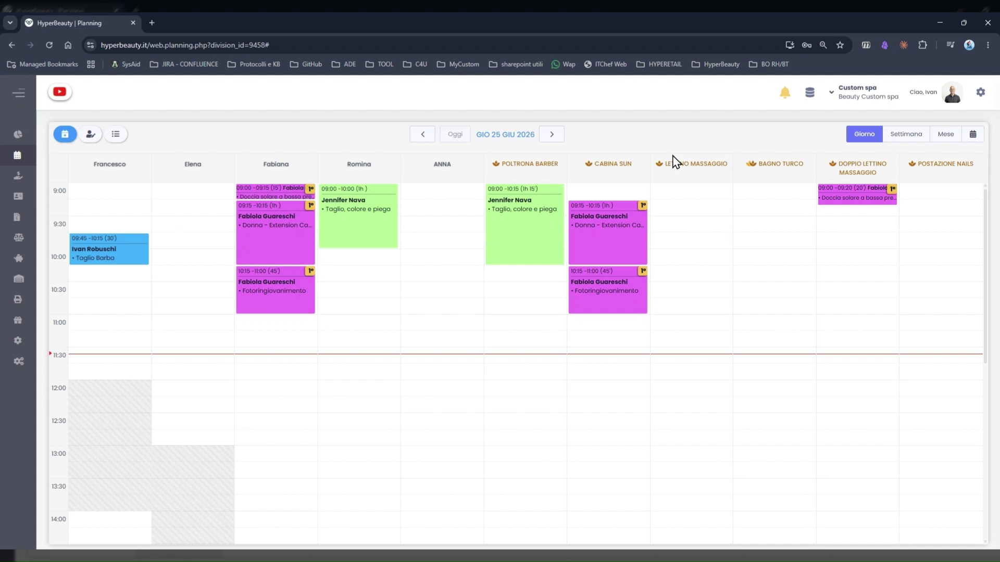
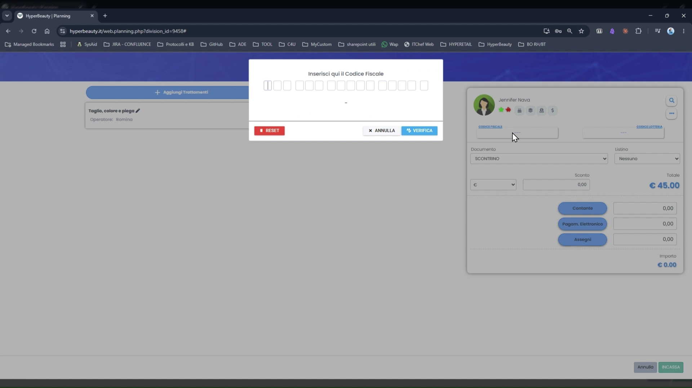
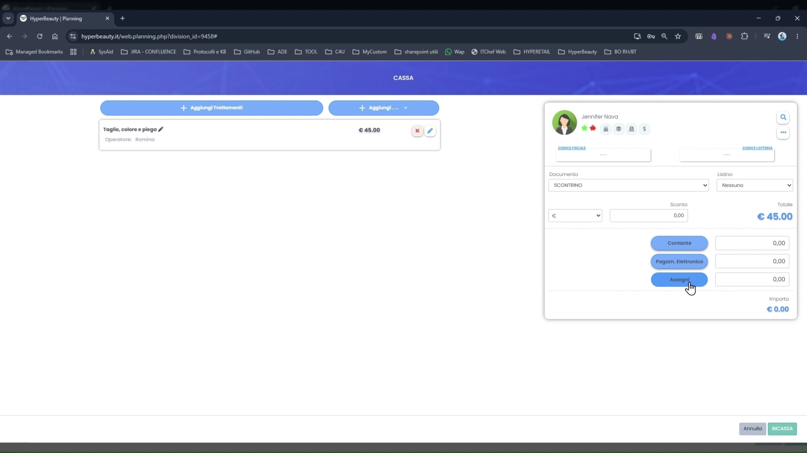
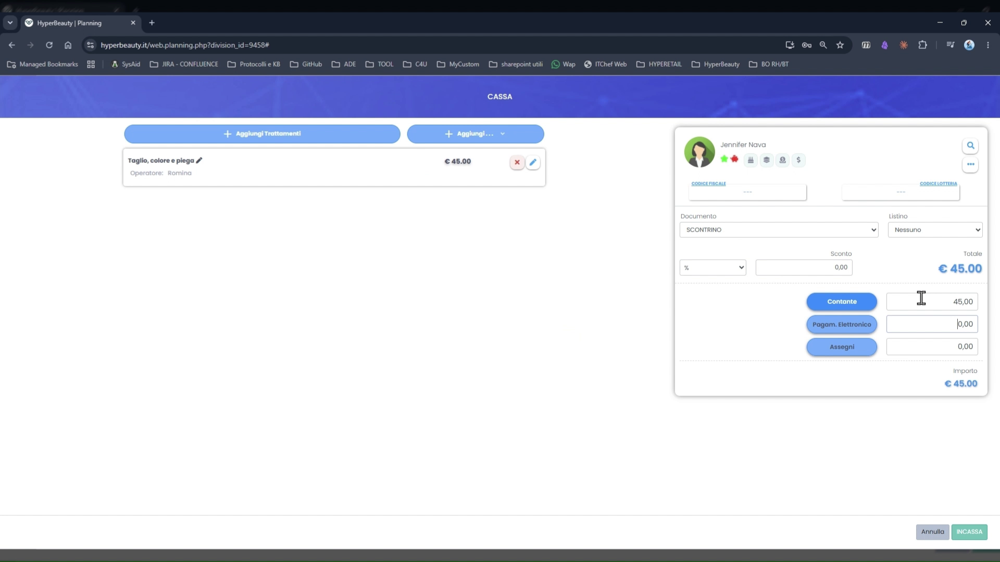
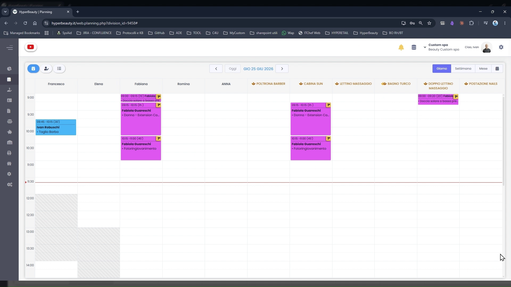

# Emissione Primo Documento Commerciale

Questa guida mostra come emettere il primo scontrino fiscale da un appuntamento in agenda. La schermata **Cassa** raccoglie il trattamento, il cliente, il metodo di pagamento e — al click su INCASSA — invia il comando al Registratore Telematico per la stampa dello scontrino.

!!! warning "Prerequisito"
    Il Registratore Telematico Custom deve essere già collegato e configurato (vedi [Collegamento RT Custom](stampante_rt.md)) e il Documento di Default deve essere impostato su SCONTRINO nel Planning.

---

<video controls width="100%" style="border-radius:8px; margin-bottom:1.5rem;">
  <source src="../assets/resources/emissione_doc_comm.mp4" type="video/mp4">
</video>

---

## Aprire la Cassa dall'appuntamento

Dal Planning, cliccare sull'appuntamento da incassare per aprire la finestra dettaglio, poi cliccare il pulsante **Cassa** (icona carrello/incassa). Si apre la schermata **CASSA**.

---

## La schermata Cassa

La schermata Cassa è divisa in due sezioni:

**Colonna sinistra — Trattamenti:**

- Il trattamento dell'appuntamento è già caricato con il prezzo di listino (es. *Taglio, colore e piega — €45,00*)
- **+ Aggiungi Trattamenti** — per aggiungere ulteriori servizi da incassare nello stesso documento
- **+ Aggiungi...** — per aggiungere prodotti, prepagate o altri voci

**Colonna destra — Cliente e pagamento:**

| Campo | Descrizione |
|-------|-------------|
| **Cliente** | Nome e icone di stato (sospesi, fidelity, ecc.) |
| **Codice Fiscale** | Opzionale — per intestare lo scontrino |
| **Codice Lotteria** | Opzionale — per partecipare alla lotteria degli scontrini |
| **Documento** | Tipo documento fiscale (default: **SCONTRINO**) |
| **Listino** | Eventuale listino prezzi applicato |
| **Sconto** | Sconto in importo fisso (C) o percentuale (%) |
| **Totale** | Importo totale da incassare |

---

## Inserire il Codice Fiscale (opzionale)

Cliccando su **CODICE FISCALE** si apre la finestra di inserimento con i 16 box del codice fiscale italiano. Inserire il codice e cliccare **VERIFICA** per validarlo prima di procedere. Il codice viene stampato sullo scontrino e consente la detraibilità fiscale per il cliente.

Il campo **CODICE LOTTERIA** funziona analogamente e permette al cliente di partecipare alla Lotteria degli Scontrini.

---

## Scegliere il metodo di pagamento

Nella sezione pagamento sono disponibili tre pulsanti:

| Pulsante | Utilizzo |
|----------|----------|
| **Contante** | Pagamento in contanti |
| **Pagam. Elettronico** | POS, carta di credito/debito |
| **Assegni** | Pagamento con assegno |

Cliccare il pulsante corrispondente al metodo scelto: il campo a destra si compila automaticamente con il totale dovuto.

È possibile **dividere il pagamento** su più metodi: ad esempio €30,00 in contante e €15,00 con POS. In questo caso compilare manualmente gli importi parziali nei campi a fianco di ogni pulsante. La somma dei metodi deve corrispondere al **Totale**.

!!! tip "Verifica importo"
    Prima di cliccare INCASSA, controllare che il campo **Importo** in basso a destra corrisponda esattamente al Totale. Se l'importo è **€0,00** il pagamento non è stato impostato correttamente.

---

## Emettere lo scontrino — INCASSA

Con tutti i campi compilati, cliccare il pulsante verde **INCASSA** in basso a destra.

Il gestionale invia il comando al Registratore Telematico che stampa lo scontrino fiscale. L'operazione è irreversibile: una volta emesso, lo scontrino non può essere annullato direttamente dalla cassa (occorre emettere un documento di reso).

---

## Risultato in Planning

Dopo l'incasso, l'appuntamento nel Planning mostra un **indicatore di chiusura** (icona ⚠️/check sul blocco). L'appuntamento passa nello stato "chiuso" e non è più evidenziato come da evadere.

Per visualizzare gli appuntamenti chiusi in agenda vedere la guida [Appuntamenti Chiusi in Agenda](visualizza_app_chiusi.md).

---

## Riepilogo

| Passo | Azione |
|-------|--------|
| 1 | Planning → click appuntamento → pulsante Cassa |
| 2 | Verificare trattamento e prezzo nella colonna sinistra |
| 3 | Verificare Documento = **SCONTRINO** |
| 4 | (Opzionale) Inserire Codice Fiscale e/o Codice Lotteria |
| 5 | (Opzionale) Applicare uno sconto in € o % |
| 6 | Cliccare **Contante** o **Pagam. Elettronico** o **Assegni** |
| 7 | Verificare che Importo = Totale |
| 8 | Cliccare **INCASSA** — lo scontrino viene stampato dall'RT |

---

*Documento a cura di Custom S.p.a. — HyperBeauty Training Program — Versione 1.0 — Giugno 2026*
