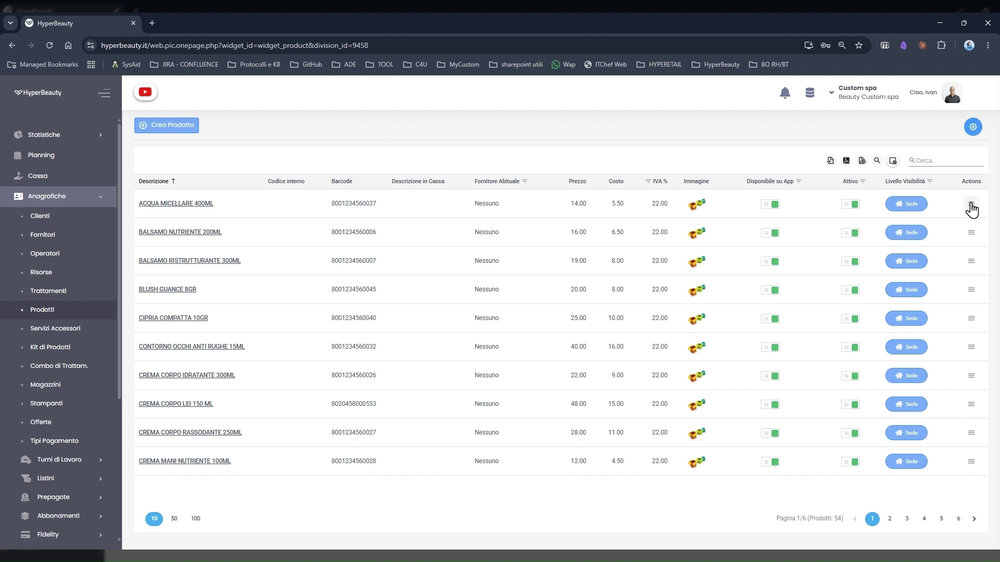
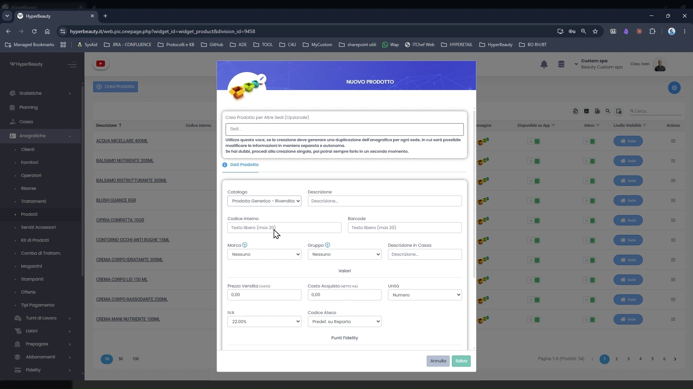
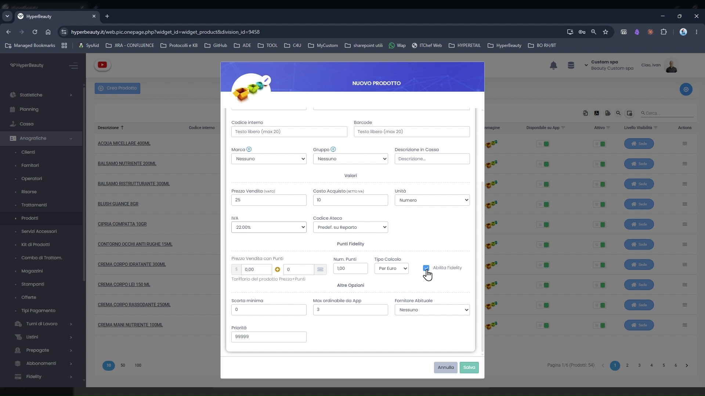

# Listino Prodotti

I prodotti sono gli **articoli fisici vendibili al banco**: shampoo, creme, cosmetici, profumi, integratori e qualsiasi altro articolo che il salone commercializza ai clienti. Configurarli permette di aggiungerli rapidamente a qualsiasi incasso in cassa — insieme o separati rispetto ai trattamenti.

!!! info "Prodotto vs Trattamento"
    Il **trattamento** genera un appuntamento in agenda e occupa uno slot temporale. Il **prodotto** è una vendita diretta al banco — non crea nessun blocco in agenda. Entrambi si aggiungono però allo stesso incasso in cassa: è possibile addebitare un trattamento e uno o più prodotti nella stessa transazione.

---

<video controls width="100%" style="border-radius:8px; margin-bottom:1.5rem;">
  <source src="../assets/resources/creazione_prodotti.mp4" type="video/mp4">
</video>

---

## Accedere al listino prodotti

**Percorso:** Menu laterale → **Anagrafiche** → **Prodotti**

La schermata elenca tutti i prodotti configurati per la sede. Per ciascuno sono visibili:

| Colonna | Descrizione |
|---------|-------------|
| **Descrizione** | Nome del prodotto |
| **Codice Interno** | Codice identificativo interno (assegnato manualmente o automaticamente) |
| **Barcode** | Codice a barre EAN — utile per la lettura con scanner in cassa |
| **Confezione Sfusa** | Indica se il prodotto è vendibile sfuso (es. per dosi singole) |
| **Prezzo** | Prezzo di vendita al pubblico (IVA inclusa) |
| **Unità** | Unità di misura (es. pz, ml) |
| **IVA** | Aliquota IVA applicata |
| **Disponibilità su App** | Se il prodotto è acquistabile tramite BeWelly (app cliente) |
| **Attivo** | Toggle per disabilitare temporaneamente il prodotto |
| **Livelli Abilitati** | Visibilità per livello di piano |

Per creare un nuovo prodotto cliccare **+ Crea Prodotto** in alto a sinistra.

---

## Creare un nuovo prodotto

**Percorso:** Anagrafiche → Prodotti → **+ Crea Prodotto**

Il pannello **NUOVO PRODOTTO** si apre come finestra modale. I campi sono organizzati in sezioni.

### Dati identificativi

| Campo | Descrizione |
|-------|-------------|
| **Descrizione** | Nome del prodotto come appare in cassa e in listino |
| **Codice Interno** | Codice alfanumerico personalizzabile (es. SKU, codice fornitore) |
| **Barcode** | Codice EAN/UPC — lasciare vuoto se non si usa scanner |
| **Categoria** | Categoria di appartenenza per organizzare il listino (es. Capelli, Viso, Corpo) |
| **Gruppo** | Sottogruppo per classificazione più granulare e per i report |

### Sezione Prezzi

| Campo | Descrizione |
|-------|-------------|
| **Prezzo Vendita (€)** | Prezzo di listino al pubblico — comprensivo di IVA |
| **IVA** | Aliquota IVA applicata al prodotto (precompilata in base alla nazione sede) |
| **Prezzo Acquisto** | Costo sostenuto dal salone — facoltativo ora, necessario per attivare il magazzino |
| **Punti Risparmio** | Punti fedeltà assegnati all'acquisto (se il modulo fidelity è attivo) |

### Campi aggiuntivi

Il form contiene anche campi per la gestione avanzata: unità di misura, tipo cassetto (per organizzatori fisici), accessori correlati e livelli di abilitazione per piano. Per un inserimento base questi campi si lasciano ai valori predefiniti.

Cliccare **SALVA** per confermare. Il prodotto appare immediatamente nel listino.

---

## Organizzare il listino con le categorie

Creare le categorie prima di inserire i prodotti rende il listino navigabile sia in cassa che nei report. Categorie consigliate per un centro estetico:

| Categoria | Esempi di prodotti |
|-----------|--------------------|
| **Capelli** | Shampoo, balsami, maschere, lacche, oli |
| **Viso** | Creme, sieri, contorno occhi, detergenti |
| **Corpo** | Creme corpo, oli massaggio, prodotti depilatori |
| **Unghie** | Smalti, gel, top coat, basi |
| **Profumi / Fragranze** | Eau de parfum, eau de toilette, deodoranti |

!!! tip "Pochi prodotti per iniziare"
    Non è necessario inserire l'intero catalogo dal primo giorno. Caricare prima i prodotti più venduti — shampoo, trattamenti di punta, best seller — e completare in seguito. La gestione magazzino completa (carichi, giacenze, inventario) è approfondita nel Webinar 2.

---

## Vendere un prodotto in cassa

Una volta inserito nel listino, il prodotto è immediatamente disponibile in cassa:

1. Aprire la **Cassa**
2. Selezionare il cliente (o Cliente Generico)
3. Cliccare **+ Aggiungi Prodotto** e scegliere dalla lista
4. Procedere con il metodo di pagamento e incassare

Il prodotto può essere aggiunto allo stesso incasso di un trattamento — il totale si aggiorna automaticamente.

!!! warning "Nota magazzino"
    Inserire il **prezzo di acquisto** già in questa fase è il primo passo per attivare la gestione del magazzino (disponibile dal piano Business). Anche se il magazzino non è attivo ora, avere questo dato popolato risparmia lavoro in futuro. Per ora è sufficiente il prezzo di vendita per poter incassare il prodotto.

---

## Riepilogo inserimento prodotto

| Passo | Azione | Obbligatorio |
|-------|--------|:---:|
| 1 | Anagrafiche → Prodotti → + Crea Prodotto | ✅ |
| 2 | Inserire Descrizione (nome prodotto) | ✅ |
| 3 | Selezionare la Categoria | ✅ |
| 4 | Inserire Prezzo di Vendita | ✅ |
| 5 | Inserire IVA (verificare che sia corretta) | ✅ |
| 6 | Inserire Prezzo di Acquisto | ⚪ Consigliato |
| 7 | Inserire Barcode (se si usa scanner) | ⚪ Opzionale |
| 8 | Cliccare SALVA | ✅ |

---

*Documento a cura di Custom S.p.a. — HyperBeauty Training Program — Versione 1.0 — Giugno 2026*
