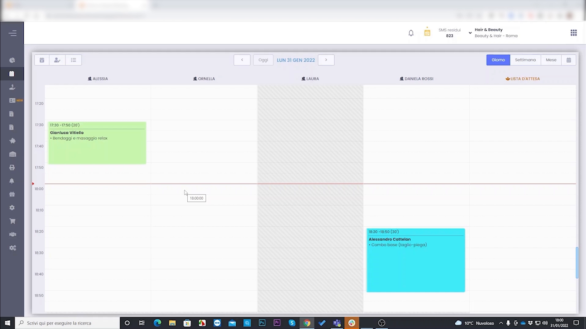
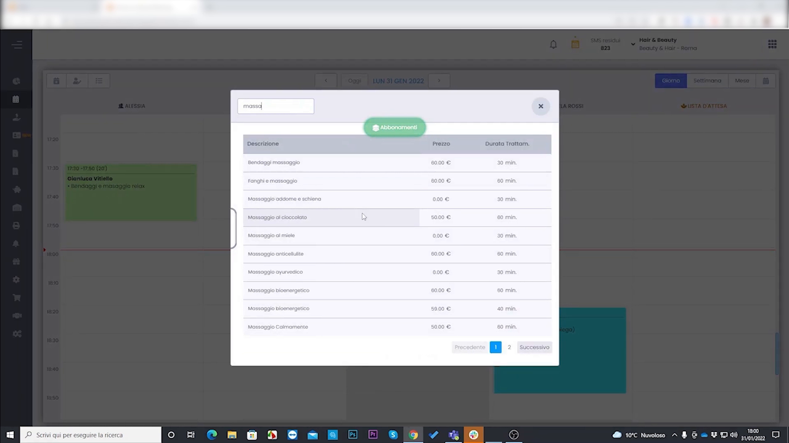
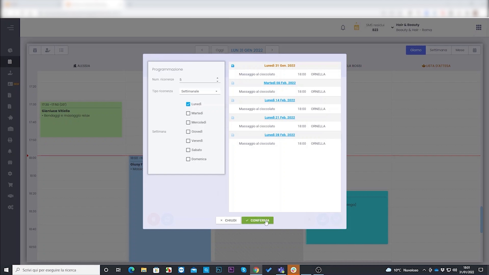
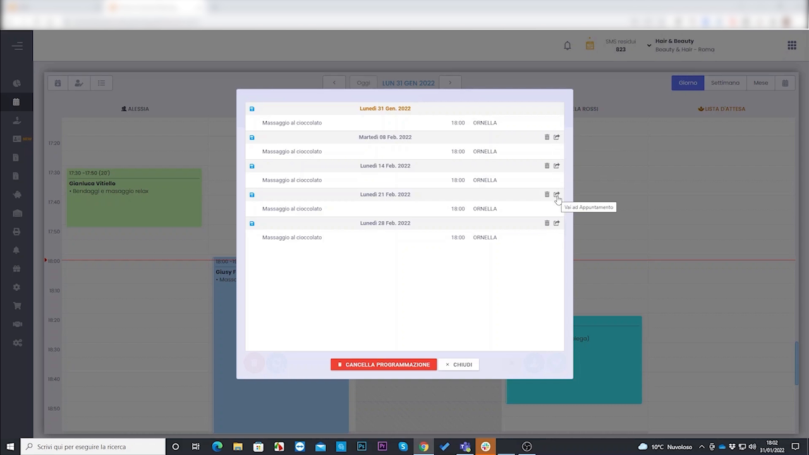
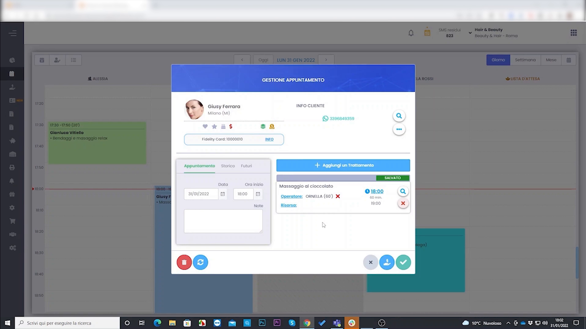

# Programmazione Appuntamenti Ricorrenti

HyperBeauty permette di creare una **serie di appuntamenti ricorrenti** per un cliente con un'unica operazione. Invece di prenotare manualmente ogni settimana, si imposta la frequenza, i giorni e il numero di appuntamenti desiderati — il gestionale li genera tutti automaticamente in agenda.

---

<video controls width="100%" style="border-radius:8px; margin-bottom:1.5rem;">
  <source src="../assets/resources/36_programmazione_appuntamenti_ricorrenti.mp4" type="video/mp4">
</video>

---

## Partenza: creare il primo appuntamento



Partire dal Planning e cliccare sulla fascia oraria desiderata per aprire la finestra di creazione appuntamento. Selezionare il cliente e procedere con la scelta del trattamento come di consueto.

---

## Selezionare il trattamento



Nella finestra di selezione trattamento, usare la ricerca per filtrare rapidamente. Selezionare il trattamento desiderato (nell'esempio: **Massaggio al cioccolato**) e cliccare **+ AGGIUNGI**.

---

## Aprire la Programmazione ricorrente

Dopo aver aggiunto il trattamento, invece di salvare subito l'appuntamento, cliccare sul pulsante **Programmazione** (disponibile nella finestra appuntamento). Si apre il pannello **Programmazione** con due sezioni affiancate: le impostazioni a sinistra e l'anteprima degli appuntamenti generati a destra.


---

## Configurare la ricorrenza

Nel pannello di sinistra impostare:

| Campo | Descrizione |
|-------|-------------|
| **Num. ricorrenze** | Quante volte ripetere l'appuntamento (es. 5 = cinque appuntamenti totali) |
| **Tipo ricorrenza** | **Settimanale** — si ripete ogni settimana nei giorni selezionati |
| **Settimana** | Checkbox per i giorni della settimana: selezionare uno o più giorni (es. ✅ Lunedì) |

Il pannello di destra aggiorna in tempo reale l'elenco di tutti gli appuntamenti che verranno creati, con data, orario e operatore assegnato.

---

## Anteprima e conferma


La colonna di destra mostra ogni appuntamento che verrà generato:

```
Lunedì 31 Gen. 2022   Massaggio al cioccolato   19:00   ORNELLA
Lunedì 07 Feb. 2022   Massaggio al cioccolato   19:00   ORNELLA
Lunedì 14 Feb. 2022   Massaggio al cioccolato   19:00   ORNELLA
Lunedì 21 Feb. 2022   Massaggio al cioccolato   19:00   ORNELLA
Lunedì 28 Feb. 2022   Massaggio al cioccolato   19:00   ORNELLA
```

Verificare che date, orari e operatore siano corretti, poi cliccare **CONFERMA**.



---

## Gestione della programmazione creata



Dopo la conferma, il sistema mostra il riepilogo completo della serie con tutti gli appuntamenti creati. Per ogni riga sono disponibili le icone di azione:

- **📅 Vai all'Appuntamento** — naviga direttamente a quell'appuntamento in agenda
- **✏️ Modifica** — modifica il singolo appuntamento della serie
- **❌ Elimina** — rimuove solo quell'occorrenza senza cancellare l'intera serie

In fondo alla lista:

| Pulsante | Azione |
|----------|--------|
| 🔴 **CANCELLA PROGRAMMAZIONE** | Elimina tutti gli appuntamenti della serie in un colpo solo |
| **CHIUDI** | Chiude il pannello tornando al Planning |

!!! warning "Cancellazione programmazione"
    Il pulsante **CANCELLA PROGRAMMAZIONE** elimina l'intera serie di appuntamenti. Per rimuovere solo una singola data, usare l'icona ❌ sulla riga corrispondente.

---

## L'appuntamento singolo nella serie



Ogni appuntamento generato dalla programmazione è un appuntamento indipendente a tutti gli effetti: ha il suo cliente, trattamento, operatore, orario e può essere modificato, spostato o incassato individualmente senza impatto sugli altri della serie.

!!! tip "Utilizzo tipico"
    La programmazione ricorrente è ideale per clienti fidelizzati con trattamenti fissi: abbonamenti settimanali (es. massaggio ogni lunedì), cicli di trattamenti estetici, o qualsiasi servizio con cadenza regolare. Riduce drasticamente il tempo di gestione agenda per questi clienti.

---

## Riepilogo

| Passo | Azione |
|-------|--------|
| 1 | Planning → click su fascia oraria → seleziona cliente |
| 2 | Aggiungi trattamento dalla lista |
| 3 | Clic su **Programmazione** nella finestra appuntamento |
| 4 | Imposta: numero ricorrenze, tipo (Settimanale), giorni della settimana |
| 5 | Verifica l'anteprima delle date generate |
| 6 | **CONFERMA** — tutti gli appuntamenti vengono creati in agenda |
| 7 | Gestisci la serie dal pannello riepilogo (modifica singoli, cancella serie) |

---

*Documento a cura di Custom S.p.a. — HyperBeauty Training Program — Versione 1.0 — Giugno 2026*
