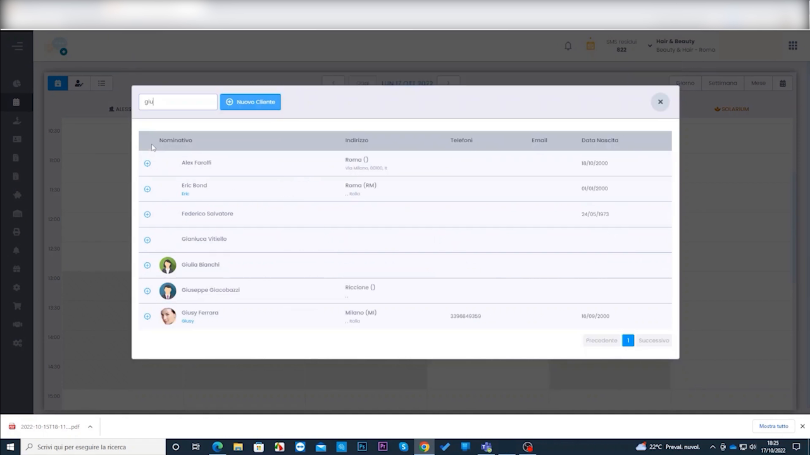
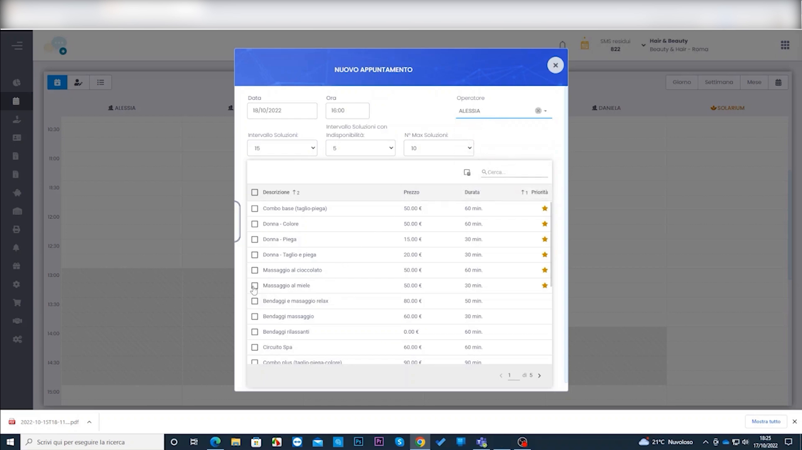
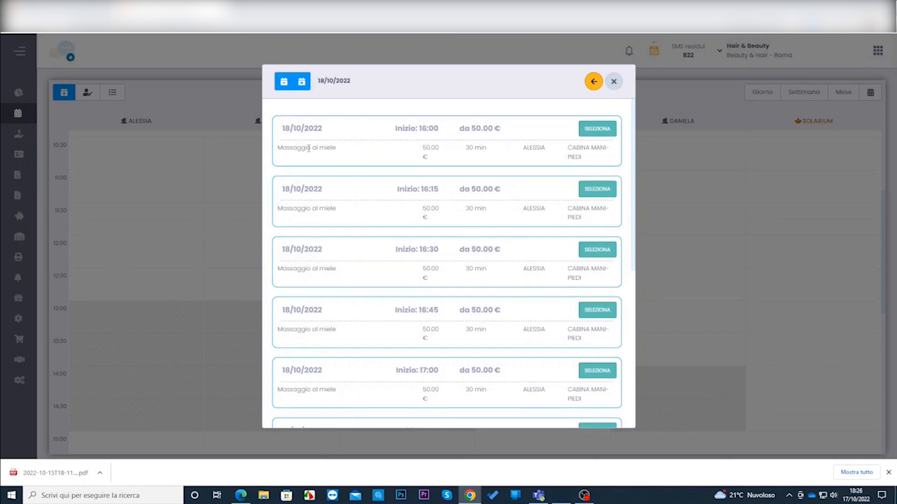
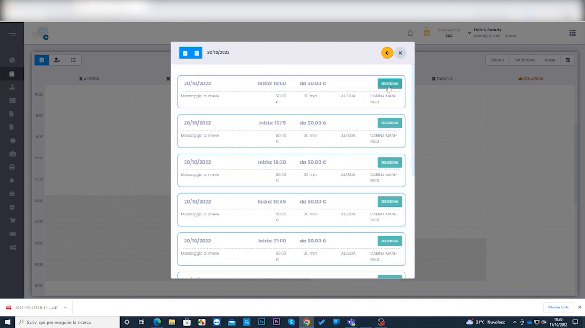
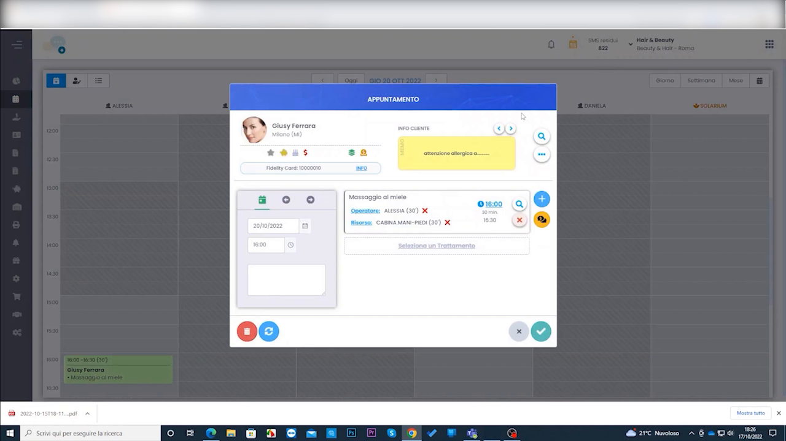

# Creazione Appuntamento con Ricerca Disponibilità

HyperBeauty offre una modalità alternativa di prenotazione: invece di cliccare su una fascia oraria specifica nel Planning, si usa la **Ricerca Disponibilità** per far trovare al sistema tutti gli slot liberi compatibili con il trattamento richiesto. Utile quando il cliente non ha un orario preciso e si vuole proporre la prima data utile.

!!! info "Prerequisito: Turni di Lavoro configurati"
    La ricerca disponibilità funziona solo se gli operatori hanno i **Turni di Lavoro** configurati in Anagrafiche → Operatori. Senza turni definiti il sistema non sa in quali fasce orarie l'operatore è disponibile.

---

<video controls width="100%" style="border-radius:8px; margin-bottom:1.5rem;">
  <source src="../assets/resources/45_creazione_appuntamento_con_ricerca_disponibilità.mp4" type="video/mp4">
</video>

---

## Aprire il pannello Nuovo Appuntamento

**Percorso:** Planning → pulsante **NUOVO APPUNTAMENTO** (in alto a sinistra)

A differenza della prenotazione standard (click su slot), questo pulsante apre una finestra dedicata alla ricerca disponibilità — senza presupporre data e orario.

---

## Selezionare il cliente

Digitare il nome o le iniziali del cliente nel campo di ricerca. La lista mostra i risultati con nominativo, indirizzo, telefono, email e data di nascita. Cliccare sul cliente desiderato per selezionarlo.

Se il cliente non è ancora in anagrafica, cliccare **+ Nuovo Cliente** per crearlo al momento.

---

## Configurare la ricerca

Il pannello mostra i parametri di ricerca e la lista completa dei trattamenti con checkbox:

| Campo | Descrizione |
|-------|-------------|
| **Data** | Data di partenza della ricerca (da quando cercare) |
| **Ora** | Ora di partenza della ricerca |
| **Operatore** | Operatore preferito (opzionale — lasciare vuoto per cercare su tutti) |
| **Intervallo Soluzioni** | Cadenza in minuti tra uno slot e il successivo (es. ogni 15 min) |
| **Intervallo Soluzioni con disponibilità** | Minuti minimi di disponibilità richiesti |
| **N° Max Soluzioni** | Numero massimo di slot da mostrare nei risultati |

Spuntare uno o più **trattamenti** dall'elenco per cui cercare la disponibilità, poi avviare la ricerca.

---

## Risultati disponibilità — navigare tra le date

Il sistema mostra tutti gli slot disponibili per la data corrente. Per ogni slot sono indicati:

- **Data e orario di inizio**
- **Prezzo** del trattamento
- **Operatore** disponibile
- **Risorsa** assegnata (es. cabina)
- Pulsante **PRENOTA** per confermare quello slot

Le frecce **◀ ▶** in alto permettono di scorrere tra le date e trovare il giorno più comodo per il cliente. La data corrente è visibile nell'intestazione del pannello.

---

## Prenotare lo slot scelto

Cliccando **PRENOTA** sullo slot desiderato si apre direttamente la finestra **APPUNTAMENTO** con tutti i campi già compilati: cliente, trattamento, operatore, risorsa, data e orario.

La scheda cliente mostra eventuali avvisi importanti (nell'esempio: nota gialla con allergia del cliente). Verificare i dati e cliccare ✅ per salvare l'appuntamento in agenda.

!!! tip "Avvisi cliente nella scheda"
    Le note di avviso (es. allergie, intolleranze) vengono mostrate in evidenza nella finestra appuntamento. Leggere sempre queste indicazioni prima di confermare il trattamento.

---

## Confronto con la prenotazione standard

| Modalità | Quando usarla |
|----------|--------------|
| **Click su slot in Planning** | Il cliente vuole un giorno e orario specifico già concordato |
| **Ricerca Disponibilità** | Il cliente è flessibile — si vuole trovare il primo slot libero utile |

---

## Riepilogo

| Passo | Azione |
|-------|--------|
| 1 | Planning → **NUOVO APPUNTAMENTO** |
| 2 | Cercare e selezionare il cliente |
| 3 | Impostare data di partenza, operatore (opzionale) e parametri di ricerca |
| 4 | Selezionare il/i trattamento/i con checkbox |
| 5 | Avviare la ricerca — il sistema mostra gli slot liberi |
| 6 | Navigare tra le date con ◀ ▶ per trovare il giorno migliore |
| 7 | Cliccare **PRENOTA** sullo slot scelto |
| 8 | Verificare i dati nella finestra appuntamento e salvare ✅ |

---

*Documento a cura di Custom S.p.a. — HyperBeauty Training Program — Versione 1.0 — Giugno 2026*
