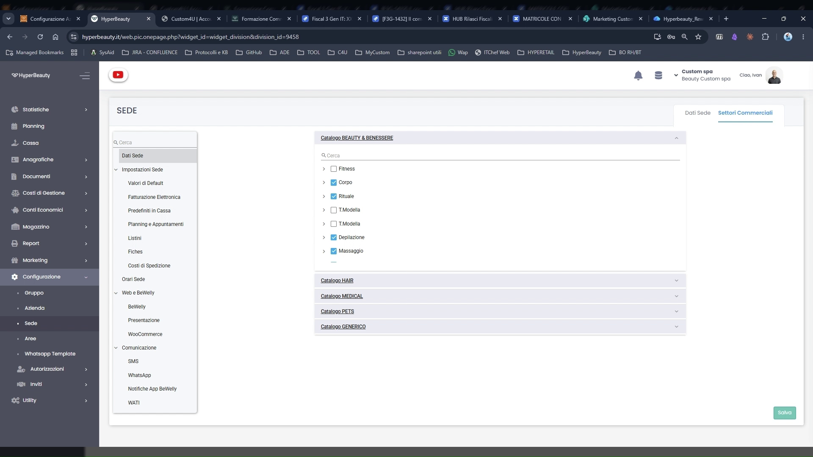
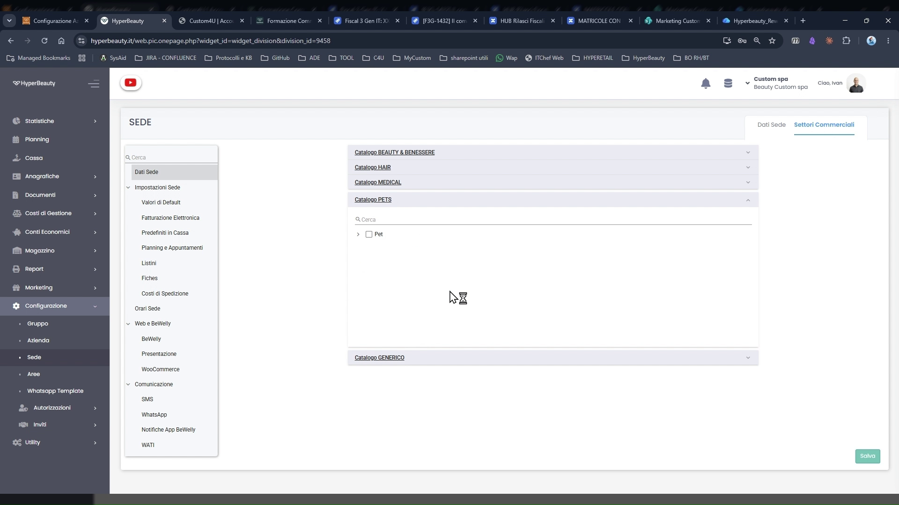
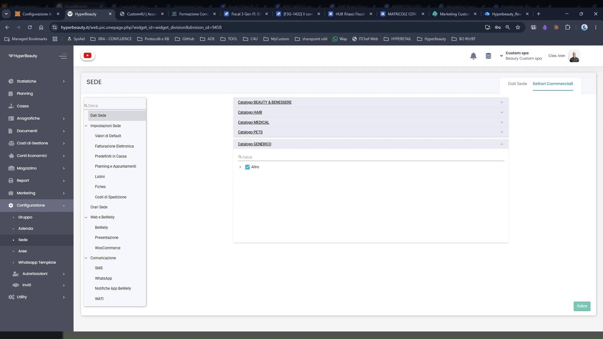

# Settori Commerciali e Catalogo Trattamenti

Prima di creare il listino trattamenti, è necessario configurare i **Settori Commerciali** della sede. Questa operazione abilita un catalogo predefinito di servizi e categorie che velocizza enormemente la creazione del listino — evitando di dover inserire tutto da zero.

---

<video controls width="100%" style="border-radius:8px; margin-bottom:1.5rem;">
  <source src="../assets/resources/cataloghi.mp4" type="video/mp4">
</video>

---

## Dove si configura

**Percorso:** Menu laterale → **Configurazione** → **Sede** → **Dati Sede** → tab **Settori Commerciali** *(in alto a destra)*

La pagina mostra i cataloghi disponibili come **pannelli espandibili**. Ogni catalogo contiene sottocategorie di trattamenti selezionabili singolarmente.

---

## I cataloghi disponibili

HyperBeauty mette a disposizione cinque cataloghi predefiniti, ciascuno progettato per un tipo specifico di attività:

| Catalogo | Destinato a |
|----------|-------------|
| **Catalogo BEAUTY & BENESSERE** | Centri estetici, SPA, istituti di bellezza, centri benessere |
| **Catalogo HAIR** | Parrucchieri, barbieri, hair stylist |
| **Catalogo MEDICAL** | Centri medico-estetici, dermatologia estetica, medicina estetica |
| **Catalogo PETS** | Toelettatori, centri benessere per animali |
| **Catalogo GENERICI** | Servizi trasversali, voci personalizzabili, attività miste |

La selezione può essere **multipla**: un centro estetico con servizi capelli selezionerà sia Beauty & Benessere che Hair.

---

## Come selezionare i settori

Cliccare su un catalogo per espanderlo e visualizzare le sottocategorie disponibili.

Per ogni catalogo è possibile:

- **Abilitare l'intero catalogo** — tutte le sottocategorie vengono importate nel listino
- **Selezionare solo alcune sottocategorie** — utile per centri specializzati che non offrono tutti i servizi del settore

Esempio — Catalogo BEAUTY & BENESSERE include sottocategorie come: Viso, Rituali, Massaggi, Trattamenti Corpo, Makeup, e altre.

Cliccare **Salva** in basso a destra per confermare la selezione.

---

## Effetto sul listino trattamenti

Dopo aver salvato i settori commerciali, quando si va a creare un trattamento in **Anagrafiche → Trattamenti**, HyperBeauty propone automaticamente le categorie e i servizi del catalogo selezionato — con nome, durata suggerita e categoria già impostati.

!!! tip "Risparmio di tempo significativo"
    Un salone con 30-40 trattamenti da inserire impiega il 70% di tempo in meno se configura correttamente i settori commerciali prima di iniziare. I trattamenti del catalogo sono un **punto di partenza**: descrizione, importo, durata e colore sono tutti modificabili liberamente.

!!! info "Nessun blocco permanente"
    I settori commerciali si possono modificare in qualsiasi momento tornando in Configurazione → Sede → Dati Sede → Settori Commerciali. Aggiungere un nuovo catalogo in seguito aggiungerà le relative categorie al listino senza eliminare quelle già create.

---

## Passo successivo

Una volta salvati i settori commerciali, il listino trattamenti è pronto per essere popolato.

➡️ Continua con: [**Listino Trattamenti**](trattamenti.md)

---

## Riepilogo

| Passo | Azione | Obbligatorio |
|-------|--------|:---:|
| 1 | Configurazione → Sede → Dati Sede → tab Settori Commerciali | ✅ |
| 2 | Espandere i cataloghi pertinenti all'attività | ✅ |
| 3 | Selezionare le sottocategorie di interesse | ✅ |
| 4 | Cliccare Salva | ✅ |
| 5 | Procedere con la creazione del listino trattamenti | ✅ |

---

*Documento a cura di Custom S.p.a. — HyperBeauty Training Program — Versione 1.0 — Giugno 2026*
