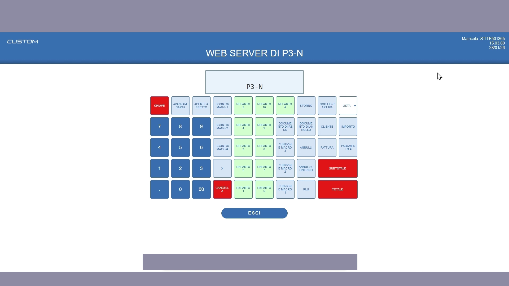
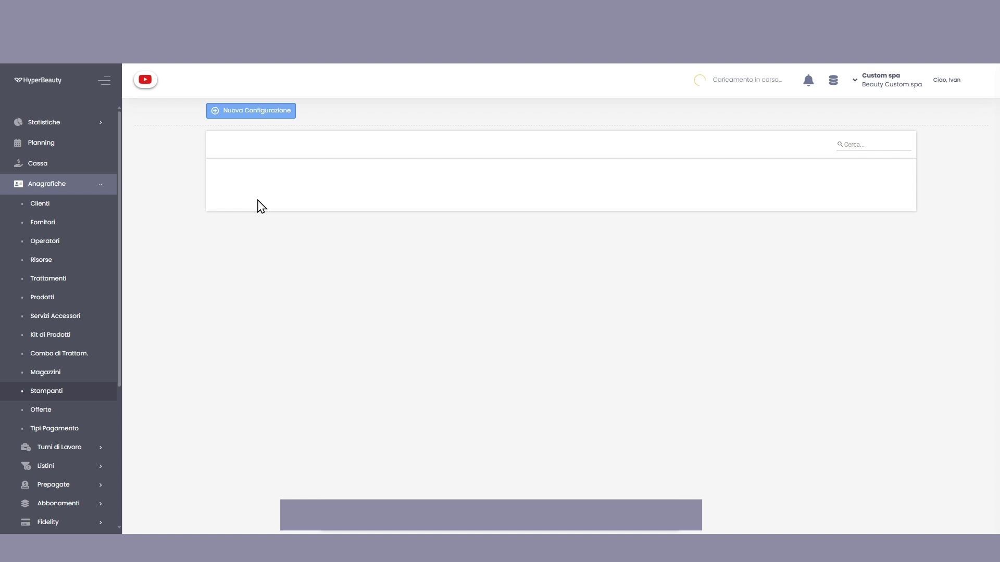
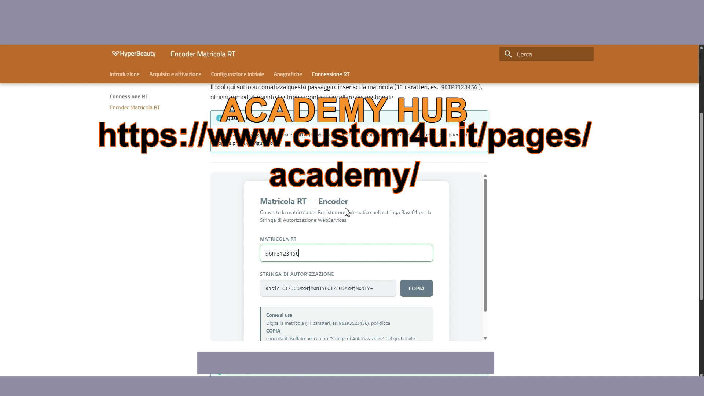
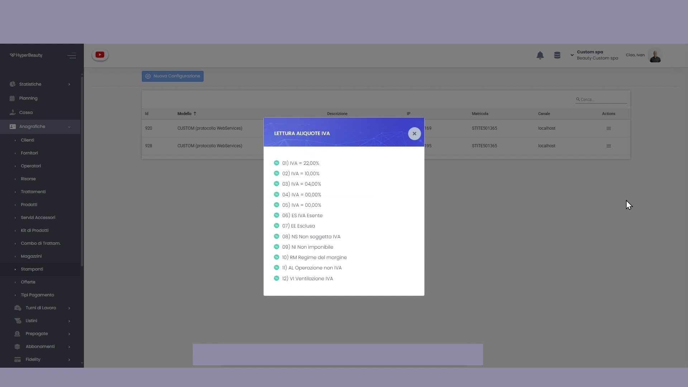
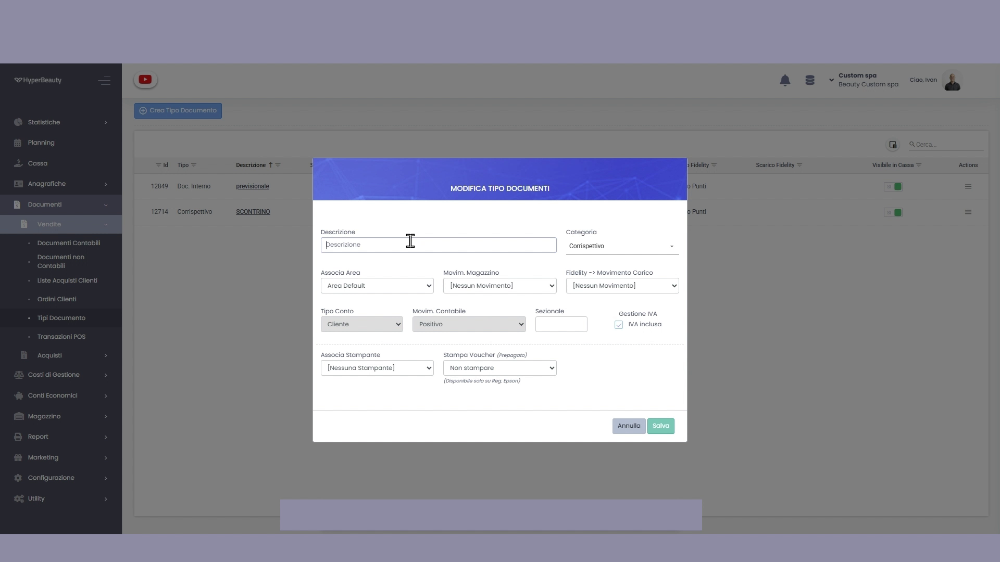
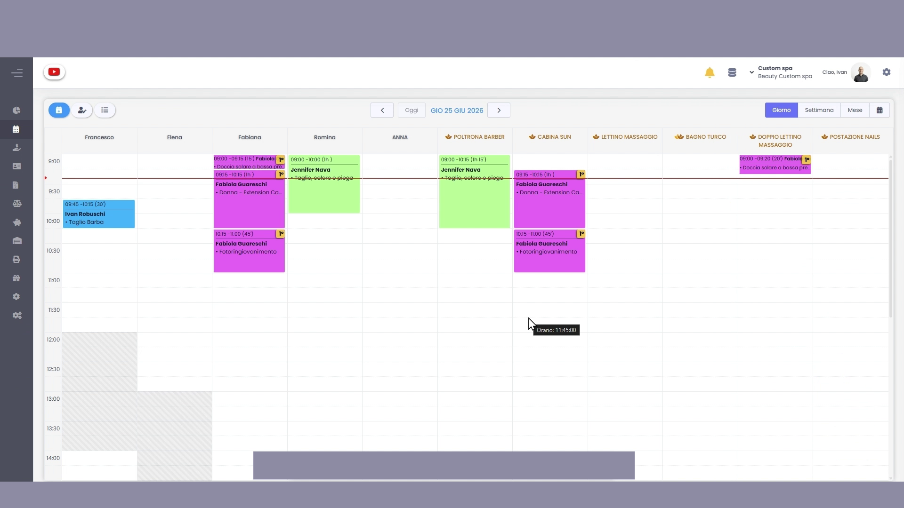

# Collegamento Registratore Telematico Custom

Questa guida copre la procedura completa di collegamento tra un Registratore Telematico **Custom** (modello con protocollo WebService) e HyperBeauty — dalle programmazioni fisiche sull'RT fino all'impostazione del documento fiscale di default in agenda.

!!! warning "Prima di iniziare"
    Avere a portata di mano: l'**indirizzo IP** che si vuole assegnare all'RT, la **matricola** del registratore (etichetta sul corpo fisico), e accesso al web server dell'RT dal browser del PC locale.

---

<video controls width="100%" style="border-radius:8px; margin-bottom:1.5rem;">
  <source src="../assets/resources/stampante_rt.mp4" type="video/mp4">
</video>

---

## Parte 1 — Programmazioni sull'RT Custom

Il web server del RT Custom (accessibile via browser digitando l'IP corrente) consente di eseguire tutte le programmazioni necessarie senza usare la tastiera fisica.

### P911 — IP statico Ethernet

Accedere alla programmazione **P911** e impostare un indirizzo IP **statico** sulla rete locale del salone. Una volta salvato, eseguire un **ping di test** dal PC per verificare che la comunicazione tra PC e RT funzioni correttamente.

!!! tip "IP statico obbligatorio"
    Se l'RT riceve un IP dinamico dal router (DHCP), l'indirizzo può cambiare al riavvio e HyperBeauty perderà il collegamento. L'IP statico garantisce che la stampante sia sempre raggiungibile allo stesso indirizzo.

### P016 — Tabella IVA

Accedere a **P016** e **non modificare nulla**. La tabella IVA di default deve rimanere esattamente com'è — sarà HyperBeauty a leggere e usare le aliquote già programmate.

### P120 — Programmazione reparti

Accedere a **P120** e programmare i **primi due reparti**:

| Reparto | Descrizione | Prezzo | Codice IVA Reparto |
|---------|-------------|--------|--------------------|
| **1** | `TRATTAMENTI` | 0,00 | 1 |
| **2** | `PRODOTTI` | 0,00 | 1 |

### Modalità FPU

Prima di procedere con la configurazione nel gestionale, mettere l'RT in **modalità FPU** tramite il comando `222 + CHIAVE` sul tastierino fisico.

---

## Parte 2 — Configurazione in HyperBeauty

### Valori di default sede

**Percorso:** Configurazione → Sede → Valori di Default

Impostare **IVA al 22%** e **valuta Euro**. Salvare.

### Nuova configurazione stampante

**Percorso:** Anagrafiche → **Stampanti** → **Nuova Configurazione**

Compilare tutti i campi del form:

| Campo | Valore |
|-------|--------|
| **Modello** | CUSTOM (protocollo WebServices) |
| **Descrizione** | Es. `STAMPANTE FISCALE` |
| **Indirizzo IP** | IP statico impostato in P911 |
| **Matricola RT** | Matricola dell'apparecchio (es. `STITE501365`) |
| **Comunicazione** | `LOCALHOST` |
| **Stringa di Autorizzazione** | `Basic [matricola:matricola in Base64]` |

### Generare la Stringa di Autorizzazione

La Stringa di Autorizzazione si ottiene codificando la matricola in formato Base64. Usare il **[Tool Encoder Matricola RT](matricola_encoder.md)** disponibile in questo corso: inserire la matricola nel campo e cliccare **COPIA** — la stringa `Basic ...` è pronta da incollare nel campo del gestionale.

### Opzioni di Cassa

Nella stessa schermata, configurare le **Opzioni di Cassa**:

| Opzione | Impostazione |
|---------|-------------|
| **Vendita Prepagate** | ✅ Multiuso — selezionare |
| **IVA Buoni Multiuso** | `N2 Non Soggette` ⚠️ *non N2.1 né N2.2* |
| **Lotteria degli Scontrini** | ✅ Selezionare |
| **Punti Fidelity** | ✅ Stampa su scontrino |
| **Residuo Prepagate** | ✅ Stampa su scontrino |

**SALVA**.

---

## Parte 3 — Lettura aliquote IVA e reparti

Dalla schermata Anagrafica Stampanti, cliccare le **tre linee orizzontali** (≡) a destra della stampante appena configurata.

### Lettura Aliquote IVA

Selezionare **Lettura Aliquote IVA**. Il gestionale si connette all'RT e legge in automatico tutte le aliquote programmate.

Il sistema mostra le aliquote lette direttamente dall'RT (22%, 10%, 4%, esenzioni, ecc.). Verificare che siano presenti e corrette — se mancano, ripetere la procedura P016 sull'RT.

### Configurazione Reparti

Tornare al menu ≡ della stampante → **Reparti**. Tramite i tre puntini → **Modifica**, configurare **Reparto 1** e **Reparto 2** con gli stessi dati impostati sull'RT in P120:

| Reparto | Descrizione | Codice IVA | Natura |
|---------|-------------|------------|--------|
| 1 | `TRATTAMENTI` | 1 (22%) | Trattamenti |
| 2 | `PRODOTTI` | 1 (22%) | Prodotti |

Il **Codice ATECO** lasciarlo invariato come unico.

**SALVA**, poi tornare in Anagrafica Stampanti → ≡ → **Settaggio Reparti** per confermare.

---

## Parte 4 — Creazione Tipo Documento "Scontrino"

**Percorso:** Menu laterale → **Documenti** → **Vendite** → **Tipi Documento** → **Crea Tipo Documento**

Compilare il form con questi valori:

| Campo | Valore |
|-------|--------|
| **Descrizione** | `SCONTRINO` |
| **Categoria** | Corrispettivo |
| **Associa Area** | Area Default |
| **Movimento** | Scarico Vendita |
| **Fidelity → Movimento Carico** | Carico Punti |
| **Gestione IVA** | ✅ IVA Inclusa |
| **Associa Stampante** | Selezionare la stampante fiscale creata |
| **Stampa Voucher** | Prezzo Esposto |

**SALVA**.

---

## Parte 5 — Documento di default nel Planning

**Percorso:** Planning → **⚙️ ingranaggio** in alto a destra → **Configurazioni**

Scorrere in basso fino alla sezione **Generali** e impostare:

**Documento di Default = `SCONTRINO`** (o il nome scelto nel passaggio precedente)

Da questo momento ogni incasso avviato dall'agenda genererà automaticamente uno scontrino fiscale tramite l'RT Custom collegato.

---

## Riepilogo procedura

| Fase | Operazione | Dove |
|------|-----------|------|
| 1 | P911 — IP statico + ping di test | Web server RT |
| 2 | P016 — NON modificare tabella IVA | Web server RT |
| 3 | P120 — Reparti 1 (Trattamenti) e 2 (Prodotti) | Web server RT |
| 4 | Modalità FPU (222 + CHIAVE) | Tastierino RT |
| 5 | Configurazione → Sede → Valori Default (IVA 22%, Euro) | HyperBeauty |
| 6 | Anagrafiche → Stampanti → Nuova Configurazione | HyperBeauty |
| 7 | Genera Stringa di Autorizzazione Base64 | Tool Encoder RT |
| 8 | Lettura Aliquote IVA | HyperBeauty |
| 9 | Configurazione Reparti | HyperBeauty |
| 10 | Documenti → Vendite → Tipi Documento → SCONTRINO | HyperBeauty |
| 11 | Planning → Configurazioni → Documento Default = SCONTRINO | HyperBeauty |

---

*Documento a cura di Custom S.p.a. — HyperBeauty Training Program — Versione 1.0 — Giugno 2026*
