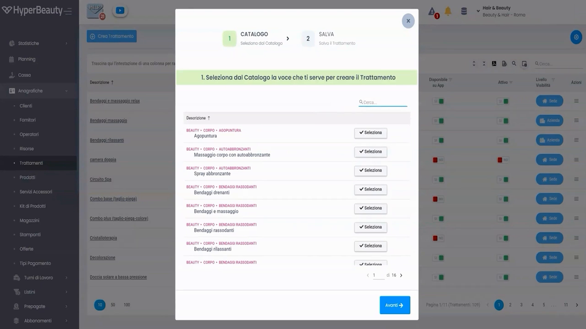
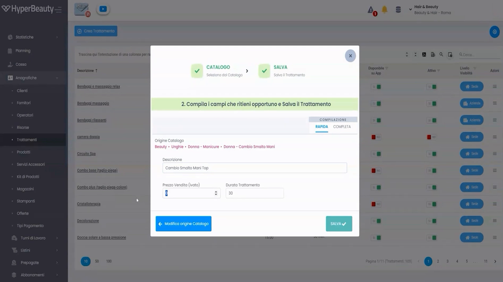
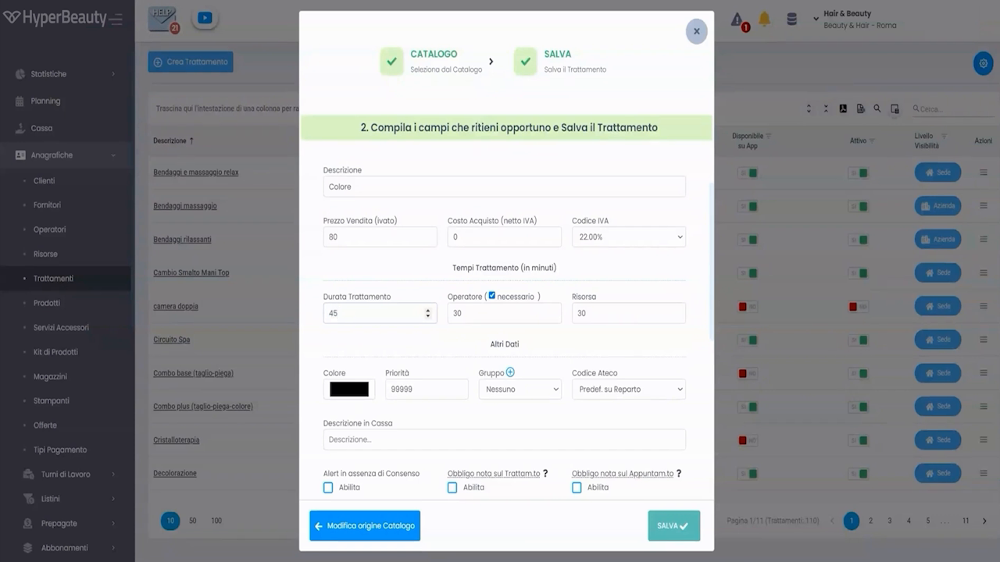
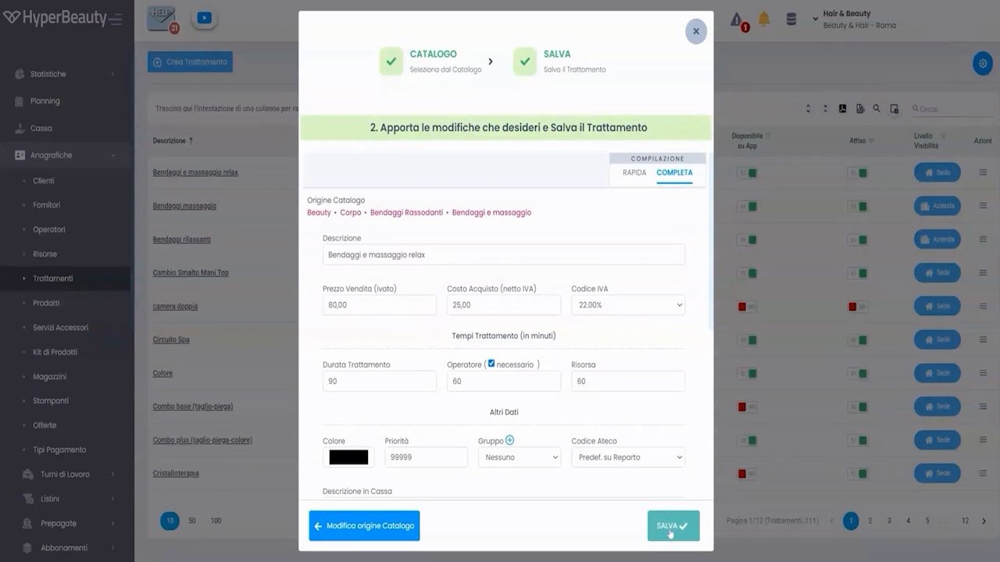
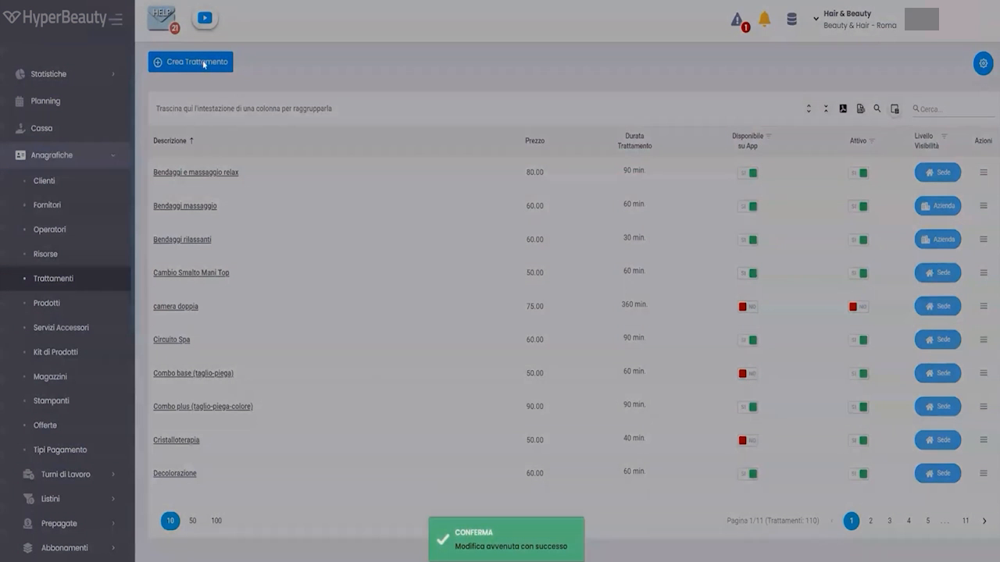

# Listino Trattamenti

I trattamenti sono il cuore operativo del gestionale: ogni appuntamento è associato a uno o più trattamenti, che determinano la durata del blocco in agenda, il prezzo in cassa e gli operatori abilitati a eseguirlo.

!!! info "Prerequisito: Settori Commerciali"
    Prima di iniziare, verificare che i [**Settori Commerciali**](settori_commerciali.md) siano stati configurati in Impostazioni → Sede → Dati Sede → tab Settori Commerciali. Questa operazione abilita il catalogo predefinito e velocizza enormemente l'inserimento.

---

<video controls width="100%" style="border-radius:8px; margin-bottom:1.5rem;">
  <source src="../assets/resources/34_inserimento_listino_trattamenti_vis_avanzata.mp4" type="video/mp4">
</video>

---

## Accedere al listino

**Percorso:** Menu laterale → **Anagrafiche** → **Trattamenti**

La schermata elenca tutti i trattamenti configurati per la sede. Per ciascuno sono visibili: Descrizione, Prezzo, Durata Trattamento, Disponibile su App, Attivo, Livello Abilitato.

Per aggiungere un trattamento cliccare **+ Crea Trattamento** in alto a sinistra.

---

## Il wizard di creazione — 2 step

La creazione di un trattamento avviene in un wizard modale con due passaggi sequenziali:

**Step 1 → CATALOGO** — seleziona un trattamento dal catalogo predefinito come punto di partenza  
**Step 2 → SALVA** — modifica i dettagli e salva

### Step 1 — Seleziona dal Catalogo

Il catalogo mostra i trattamenti disponibili in base ai settori commerciali abilitati, organizzati per percorso (es. `BEAUTY • CORPO • BENDE RASSODANTI`). Un campo di ricerca permette di filtrare rapidamente per parola chiave.

Cliccare **Selezione** accanto al trattamento desiderato, poi **Avanti →** per procedere.

!!! tip "Creare un trattamento non presente nel catalogo"
    Se il trattamento non è nel catalogo, scorrere in fondo alla lista e utilizzare l'opzione per crearlo manualmente — tutti i campi saranno vuoti e completamente liberi.

---

### Step 2 — Compilazione e salvataggio

Dopo aver selezionato il trattamento dal catalogo, il sistema mostra il form di compilazione con due modalità selezionabili tramite tab:

---

## Compilazione Rapida

La modalità **COMPILAZIONE RAPIDA** mostra solo i campi essenziali:

| Campo | Descrizione |
|-------|-------------|
| **Descrizione** | Nome del trattamento — precompilato dal catalogo, modificabile |
| **Prezzo Vendita (IVato)** | Prezzo al pubblico comprensivo di IVA |
| **Durata Trattamento** | Durata in minuti — determina la lunghezza del blocco in agenda |

Cliccare **SALVA ✓** per confermare. Il trattamento appare immediatamente nel listino.

!!! tip "Quando usare la modalità Rapida"
    Ideale in fase di startup per inserire velocemente tutti i trattamenti con i dati minimi. I dettagli (costo acquisto, operatori, risorsa) si possono completare in seguito modificando il trattamento.

---

## Compilazione Completa

La modalità **COMPILAZIONE COMPLETA** espone tutti i parametri del trattamento:

### Sezione Prezzi e IVA

| Campo | Descrizione |
|-------|-------------|
| **Prezzo Vendita (IVato)** | Prezzo finale al cliente |
| **Costo Acquisto (Netto IVA)** | Costo sostenuto dal salone — usato per il calcolo margine nei report |
| **Codice IVA** | Aliquota IVA applicata (es. 22,10%) — precompilata in base alla nazione sede |

### Sezione Tempi

| Campo | Descrizione |
|-------|-------------|
| **Durata Trattamento (minuti)** | Lunghezza totale del blocco in agenda. Impatta direttamente sulla capacità dell'agenda: un trattamento da 90 min blocca l'operatore per 90 min. |
| **Operatore** (checkbox + minuti) | Se spuntato "Necessario", l'appuntamento richiede un operatore. Il valore in minuti indica per quanto tempo l'operatore è effettivamente impegnato sul cliente (può essere inferiore alla durata totale se parte del tempo è "in posa"). |
| **Risorsa** (minuti) | Per quanti minuti occupa la risorsa (cabina, lettino, ecc.). Utile per trattamenti con posa dove il cliente è autonomo ma occupa lo spazio. |

!!! warning "Durata vs tempo operatore vs tempo risorsa"
    Esempio: colorazione da 90 minuti totali. L'operatore è impegnato attivamente solo 30 minuti (applicazione). La cabina è occupata per tutti i 90 minuti (posa inclusa). Impostare: Durata = 90, Operatore = 30, Risorsa = 90. Questo permette all'agenda di assegnare l'operatore ad altri clienti durante la posa.

### Sezione Altri Dati

| Campo | Descrizione |
|-------|-------------|
| **Colore** | Colore del blocco appuntamento in agenda — rilevante se si usa la modalità colori per trattamento |
| **Priorità** | Ordine di visualizzazione nelle liste e nel selettore trattamenti in cassa |
| **Gruppo** | Raggruppamento per report e statistiche |
| **Codice Ateco** | Predefinito su reporto — gestito dal registratore telematico |
| **Descrizione in Cassa** | Testo alternativo che appare sullo scontrino (se diverso dalla descrizione interna) |

### Alert e obbligatorietà

Nella parte inferiore del form sono presenti tre checkbox di alert:

- **Abilitato su Trattamento** — attiva avvisi specifici al momento della prenotazione
- **Obbligato nello sul Trattam.to** — rende obbligatoria la compilazione di un campo al momento della prenotazione
- **Obbligato nello sul Rapprtm.to** — obbligatorio per i report

Per la maggior parte dei trattamenti standard questi campi si lasciano disabilitati.

---

## Il listino dopo l'inserimento

Dopo il salvataggio il sistema mostra una notifica verde di conferma e il trattamento appare nella lista.

La lista mostra per ogni trattamento: Descrizione, Prezzo, Durata, disponibilità su App BeWelly, stato Attivo e Livello Abilitato. Da qui è possibile modificare qualsiasi trattamento cliccando sul pulsante **Modif.** a destra.

---

## Consigli pratici per l'inserimento

!!! tip "Prepara i dati in anticipo"
    Far preparare al titolare un foglio Excel con: nome trattamento, prezzo, durata in minuti. L'inserimento nel gestionale è rapido — avere i dati pronti dimezza i tempi. Un listino da 30 trattamenti si inserisce in 15-20 minuti con la modalità Rapida.

!!! warning "La durata è critica"
    Una durata sbagliata si ripercuote su tutta l'agenda: trattamenti troppo brevi creano sovrapposizioni, troppo lunghi sprecano slot disponibili. Verificare sempre con il titolare i tempi reali di erogazione prima di inserire.

!!! info "Modifica successiva"
    Tutti i trattamenti si possono modificare in qualsiasi momento da Anagrafiche → Trattamenti → Modif. Le modifiche ai prezzi non impattano gli appuntamenti già salvati.

---

## Riepilogo inserimento trattamento

| Passo | Azione | Modalità |
|-------|--------|----------|
| 1 | Anagrafiche → Trattamenti → + Crea Trattamento | — |
| 2 | Cerca e seleziona dal catalogo predefinito | Step 1 |
| 3 | Scegli Compilazione Rapida o Completa | Step 2 |
| 4 | Verifica/modifica Descrizione, Prezzo, Durata | Obbligatorio |
| 5 | Imposta tempi Operatore e Risorsa se necessario | Consigliato |
| 6 | Clicca SALVA ✓ | — |
| 7 | Ripeti per tutti i trattamenti del listino | — |

---

*Documento a cura di Custom S.p.a. — HyperBeauty Training Program — Versione 1.0 — Giugno 2026*
