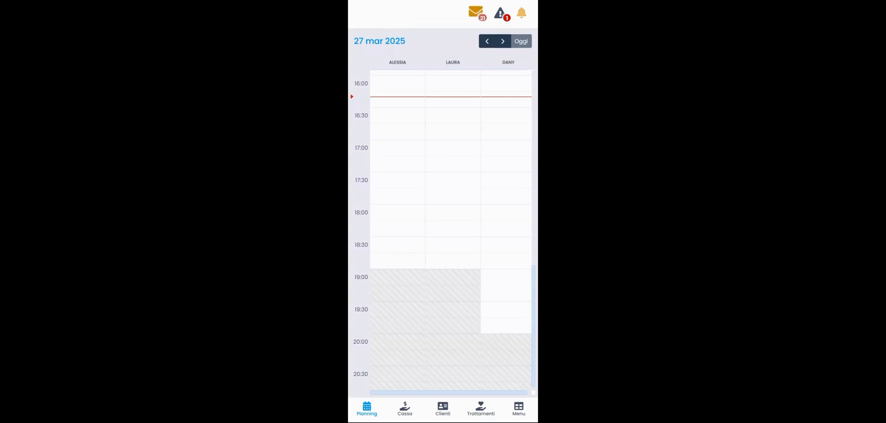
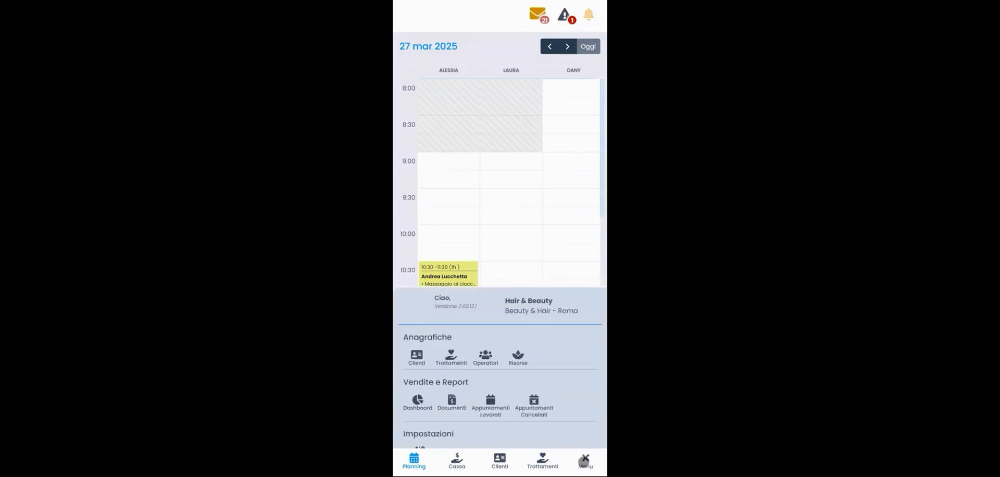
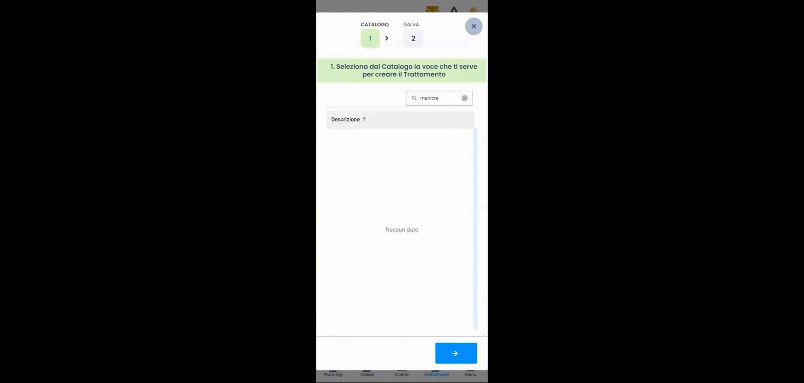
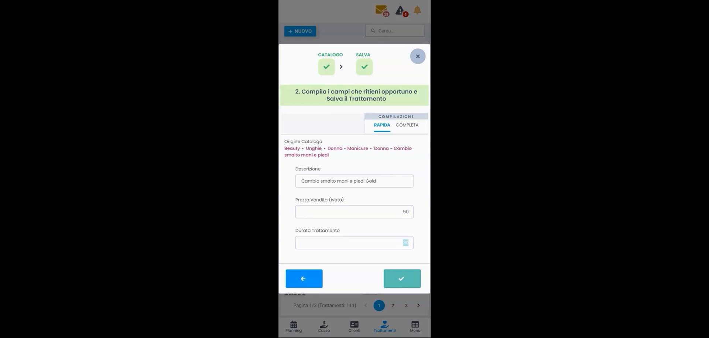

# Listino Trattamenti — Vista Semplificata (App Mobile)

HyperBeauty dispone di una **versione mobile** ottimizzata per smartphone e tablet. L'inserimento del listino trattamenti dall'app segue la stessa logica a wizard della versione desktop, ma con una navigazione semplificata pensata per schermi touch.

!!! info "Prerequisito: Settori Commerciali"
    Prima di procedere, verificare che i [**Settori Commerciali**](settori_commerciali.md) siano configurati. Abilitare i cataloghi corretti rende il wizard molto più rapido.

---

<video controls width="100%" style="border-radius:8px; margin-bottom:1.5rem;">
  <source src="../assets/resources/61_inserimento_listinotrattamenti_semplificata.mp4" type="video/mp4">
</video>

---

## Navigazione nell'app mobile

L'app HyperBeauty si controlla tramite la **barra di navigazione in basso** con cinque voci:

| Tab | Funzione |
|-----|----------|
| **Planning** | Agenda giornaliera per operatore |
| **Cassa** | Gestione pagamenti e documenti fiscali |
| **Clienti** | Anagrafica clienti |
| **Trattamenti** | Listino trattamenti della sede |
| **Menu** | Accesso a tutte le sezioni (Anagrafiche, Vendite e Report, Impostazioni) |

---

## Struttura del menu completo

Il tab **Menu** apre un pannello con l'accesso completo a tutte le funzionalità:

| Sezione | Voci disponibili |
|---------|-----------------|
| **Anagrafiche** | Clienti, Trattamenti, Operatori, Risorse |
| **Vendite e Report** | Dashboard, Documenti, Appuntamenti Lavorati, Appuntamenti Cancellati |
| **Impostazioni** | Configurazione sede e parametri |

In fondo al pannello sono visibili la versione del software installata (es. `Versione 2 (6212)`) e il nome sede configurata.

---

## Accedere al listino trattamenti

**Percorso app:** Tab **Trattamenti** (barra in basso) oppure **Menu → Anagrafiche → Trattamenti**

La schermata mostra il listino trattamenti attivi con paginazione (es. `Pagina 1/3 — Trattamenti: 111`). In alto a sinistra il pulsante **+ NUOVO** per aggiungere un trattamento.

---

## Wizard di creazione — 2 step

Il wizard è identico alla versione desktop: due step sequenziali mostrati in un pannello modale.

### Step 1 — Selezione dal Catalogo

Il sistema mostra l'intestazione: **"1. Seleziona dal Catalogo la voce che ti serve per creare il Trattamento"**

La lista dei trattamenti del catalogo è filtrata in base ai settori commerciali abilitati. Un campo di ricerca in alto permette di trovare rapidamente la voce desiderata digitando parte del nome (es. "manicure", "massaggio", "colore").

!!! tip "Ricerca nel catalogo"
    Se digitando una parola non compaiono risultati ("Nessun dato"), verificare l'ortografia o provare con una parola più generica. Il catalogo è in italiano — "colore capelli" non trova risultati, "colorazione" sì.

Toccare il trattamento desiderato per selezionarlo, poi premere la **freccia → (Avanti)** in basso a destra.

---

### Step 2 — Compilazione e salvataggio

Il pannello mostra: **"2. Compila i campi che ritieni opportuno e Salva il Trattamento"**

In cima sono visibili i due step con spunta verde (✓) a conferma della selezione completata. Sotto, due tab selezionabili:

- **RAPIDA** *(selezionata di default)*
- **COMPLETA**

#### Compilazione RAPIDA — campi visibili

| Campo | Descrizione |
|-------|-------------|
| **Origine Catalogo** | Percorso del catalogo sorgente (sola lettura) — es. `Beauty • Unghie • Donna - Manicure • Donna - Cambio smalto mani e piedi` |
| **Descrizione** | Nome del trattamento precompilato dal catalogo — modificabile liberamente |
| **Prezzo Vendita (IVato)** | Prezzo al pubblico comprensivo di IVA |
| **Durata Trattamento** | Durata in minuti — determina la lunghezza del blocco in Planning |

Premere **✓ (spunta verde)** in basso a destra per salvare. Il trattamento viene aggiunto immediatamente al listino.

!!! tip "Modalità COMPLETA da mobile"
    Anche dall'app è possibile passare al tab **COMPLETA** per impostare costo acquisto, tempi operatore e risorsa, colore, ecc. La procedura è identica alla [vista avanzata desktop](trattamenti.md). Per un inserimento veloce in fase di startup, la modalità RAPIDA è sufficiente.

---

## Differenze rispetto alla vista desktop

| Aspetto | App Mobile | Desktop |
|---------|-----------|---------|
| Navigazione principale | Barra in basso (5 tab) | Menu laterale |
| Accesso trattamenti | Tab "Trattamenti" | Anagrafiche → Trattamenti |
| Wizard creazione | Identico (2 step) | Identico (2 step) |
| Modalità disponibili | Rapida + Completa | Rapida + Completa |
| Visualizzazione lista | Paginata, ottimizzata touch | Tabella con più colonne visibili |

---

## Riepilogo inserimento da app mobile

| Passo | Azione |
|-------|--------|
| 1 | Aprire l'app HyperBeauty sul dispositivo mobile |
| 2 | Toccare il tab **Trattamenti** nella barra in basso |
| 3 | Premere **+ NUOVO** |
| 4 | Cercare e selezionare il trattamento dal catalogo (Step 1) |
| 5 | Premere **→** per passare allo Step 2 |
| 6 | Verificare/modificare Descrizione, Prezzo, Durata |
| 7 | Premere **✓** per salvare |
| 8 | Ripetere per tutti i trattamenti del listino |

---

*Documento a cura di Custom S.p.a. — HyperBeauty Training Program — Versione 1.0 — Giugno 2026*
