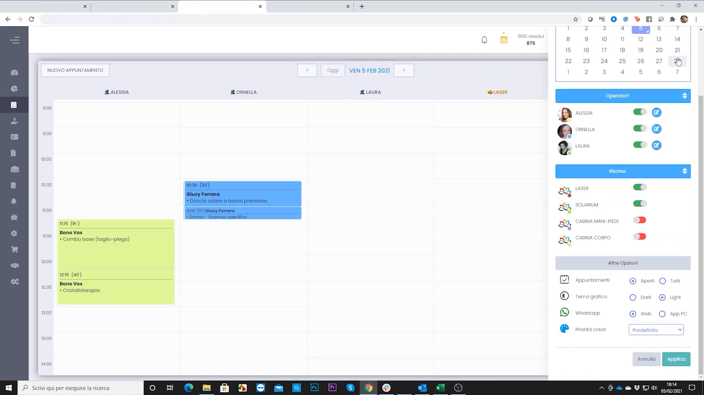
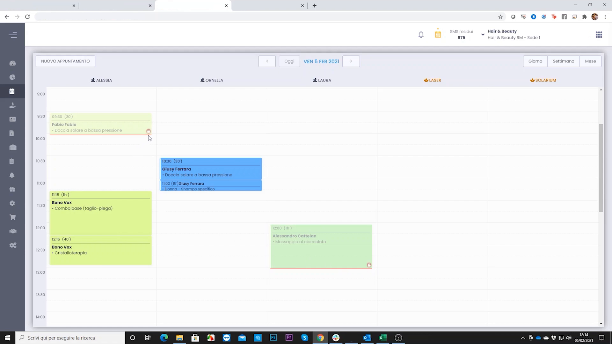

# Visualizzare Appuntamenti Chiusi sul Planning

Per impostazione predefinita il Planning mostra solo gli appuntamenti **aperti** — quelli non ancora incassati. È possibile attivare la visualizzazione degli appuntamenti **chiusi** (già incassati) per avere un quadro completo della giornata, distinguendoli visivamente da quelli ancora da evadere.

---

<video controls width="100%" style="border-radius:8px; margin-bottom:1.5rem;">
  <source src="../assets/resources/19_visualizzare_appuntamenti_chiusi_sul_planning.mp4" type="video/mp4">
</video>

---

## Aprire le opzioni del Planning

**Percorso:** Planning → icona **⚙️ ingranaggio** in alto a destra → pannello opzioni

Il pannello laterale mostra tre sezioni:

- **Operatori** — toggle per mostrare/nascondere singoli operatori in agenda
- **Risorse** — toggle per mostrare/nascondere le colonne risorse (cabine, macchinari, ecc.)
- **Altre Opzioni** — impostazioni di visualizzazione dell'agenda

---

## Attivare la visualizzazione degli appuntamenti chiusi

Nella sezione **Altre Opzioni**, trovare la riga **Appuntamenti** con le opzioni:

- **Aperti** *(selezione di default)* — mostra solo gli appuntamenti non ancora incassati
- **Tutti** — mostra sia gli appuntamenti aperti che quelli già chiusi/incassati

Selezionare **Tutti**, poi cliccare **APPLICA**.

---

## Come si distinguono in agenda

Dopo aver applicato l'opzione, il Planning mostra entrambi i tipi con una differenza visiva immediata:

| Tipo | Aspetto in agenda |
|------|------------------|
| **Aperto** | Colore pieno e saturo — da evadere |
| **Chiuso** | Colore sbiadito/trasparente + icona di chiusura | 

Gli appuntamenti chiusi mantengono nome cliente e trattamento leggibili ma sono visivamente in secondo piano rispetto a quelli ancora aperti, evitando confusione durante la giornata operativa.

!!! tip "Quando è utile"
    Attivare questa visualizzazione è particolarmente utile a fine giornata per verificare che tutti gli appuntamenti siano stati incassati, oppure quando si vuole consultare lo storico della sessione corrente senza uscire dal Planning.

!!! info "Impostazione non persistente"
    La selezione "Tutti" si applica alla sessione corrente. Alla riapertura del Planning il filtro torna al valore di default (Aperti). Impostare la preferenza all'inizio di ogni turno se necessario.

---

*Documento a cura di Custom S.p.a. — HyperBeauty Training Program — Versione 1.0 — Giugno 2026*
